# Sumaura Architecture

This document provides a deeper look at Sumaura’s runtime architecture, data flow, and key components. For a quick overview and how to run the stack, see `README.md`.

## Overview

- SPA served by Nginx on port 8080, proxying API requests to the backend.
- Backend: Rust (Axum + SQLx) with Redis caching (required) and PostgreSQL persistence.
- Multi‑tenant isolation enforced via PostgreSQL Row‑Level Security (RLS).
- Multi-provider architecture with Plaid (managed) and Teller (self-hosted) sharing a unified backend trait.
- Deployed locally via Docker Compose; macOS → Linux cross‑compile for backend binary.

## Diagram

```mermaid
flowchart LR

  A["Browser (React SPA)"] -->|SPA assets| B["Nginx (8080)"]
  A -->|/health| B
  A -->|/api/&#42;| B

  B -->|proxy /health| C["Backend (Axum, 3000)"]
  B -->|proxy /api/&#42;| C

  C -->|cache &#40;required&#41;| D[(Redis)]
  D --> C
  C -->|SQLx| E[(PostgreSQL)]
  E --> C

  C -.->|Plaid API| F["Plaid"]
  C -.->|Teller API| G["Teller"]
  A -->|Plaid Link SDK| F
  A -->|Teller Connect.js| G

  subgraph "Docker Compose Network"
    B
    C
    D
    E
  end
```

## End‑to‑End Data Flow

**Plaid (production path)**

1. Frontend requests a Plaid `link_token` from the backend and opens Plaid Link.
2. Browser receives `public_token` from Plaid → posts to `/api/plaid/exchange-token`.
3. Backend exchanges for `access_token`, encrypts it (AES‑256‑GCM), stores it, and starts initial sync (cursor cached; transactions inserted into PostgreSQL).
4. Frontend polls `/api/plaid/status` and fetches accounts via `/api/plaid/accounts`.
5. Analytics endpoints compute over PostgreSQL (optionally leveraging a transaction cache) and return aggregates.

**Teller (self-hosted path)**

1. Frontend loads Teller Connect.js via `useTellerConnect` and posts successful enrollments to `/teller/connect`.
2. Backend uses the `TellerProvider` (mTLS) to persist credentials, fetch accounts, and queue syncs.
3. Normalized transactions flow through the same Sync/Analytics services used by Plaid.

## Components

### Frontend

- React 18 + Vite SPA, served by Nginx on port 8080.
- Centralized `ApiClient` with retry and automatic token refresh; domain services: `TransactionService`, `PlaidService`, `AnalyticsService`, `BudgetService`.
- Plaid integration via `react-plaid-link`: browser handles user auth; backend never sees bank credentials.
- State via React hooks and custom hooks: `usePlaidConnection` (single) and `usePlaidConnections` (multi).
- Charts with Recharts; Tailwind CSS for styling.

### Backend

- Axum + SQLx with trait‑based DI for testability.
- Auth with JWT access/refresh; middleware validates tokens and sets the current user.
- Redis‑backed session/cache; app fails fast if Redis is unavailable.
- Plaid endpoints: link token generation, token exchange, accounts, sync, status, disconnect, clear data.
- Analytics endpoints: spending summaries and time‑series over PostgreSQL.
- Provider abstraction (`FinancialDataProvider`) dispatches between Plaid and Teller implementations transparently.

### API Proxy (Nginx)

- Serves static SPA assets and proxies `GET /health` and `/api/*` to `backend:3000` inside the Compose network.

## Caching (Redis)

- Session and data caches use namespaced keys; JSON for complex values. Examples:
  - `jwt:{jti}` — JWT allowlist; TTL matches token expiry
  - `plaid:access_token:{item_id}` — encrypted Plaid access token; TTL ~1h
  - `teller:access_token:{enrollment_id}` — encrypted Teller access token; TTL ~1h
  - `{provider}:account_mapping:{account_id}` — account mappings; TTL ~2h
  - `{provider}:{user_id}:synced_transactions` — recent sync cache; TTL ~30m
- Invalidation strategy:
  - On JWT expiry/logout: session‑scoped keys expire by TTL.
  - On disconnect or “clear synced data”: delete provider-scoped tokens, mappings, and transaction caches for the item/enrollment.

## Database (PostgreSQL)

- Core tables: users, accounts, transactions, budgets, financial connections, provider credentials.
- Migrations managed by `sqlx migrate`; executed on container start in Docker.

## Multi‑Tenancy (RLS)

- Enforcement: RLS policies restrict every read/write to the authenticated user, e.g., `user_id = current_setting('app.current_user_id', true)::uuid`.
- Request scoping: After JWT validation, the backend sets `SET LOCAL app.current_user_id = '<uuid>';` so all queries automatically obey RLS.
- Least privilege: The application DB role cannot bypass RLS.
- Cache isolation: Redis keys are namespaced by session and provider-specific identifiers (Plaid item IDs, Teller enrollment IDs).

## Development URLs

- Validate end‑to‑end only at `http://localhost:8080` (SPA via Nginx with API proxy).
- Vite dev server ports are fine for UI iteration but not for E2E validation.
