# Sumurai Architecture

This document provides a deeper look at Sumurai’s runtime architecture, data flow, and key components. For a quick overview and how to run the stack, see `README.md`.

## Overview

- SPA served by Nginx on port 8080, proxying API requests to the backend.
- Backend: Rust (Axum + SQLx) with Redis caching (required) and PostgreSQL persistence.
- Multi‑tenant isolation enforced via PostgreSQL Row‑Level Security (RLS).
- Teller integration for bank data aggregation (self‑hosted, private).
- Deployed locally via Docker Compose; macOS → Linux cross‑compile for backend binary.

## Diagram

```mermaid
flowchart LR

  A["Browser (React SPA)"] -->|SPA assets| B["Nginx (8080)"]
  A -->|/health| B
  A -->|/api/&#42;| B

  B -->|proxy /health| C["Backend (Axum, 3000)"]
  B -->|proxy /api/&#42;| C

  C -->|cache &#40;required&#41;| D[(Redis)]
  D --> C
  C -->|SQLx| E[(PostgreSQL)]
  E --> C

  C -.->|Teller API| G["Teller"]
  A -->|Teller Connect.js| G

  subgraph "Docker Compose Network"
    B
    C
    D
    E
  end
```

## End‑to‑End Data Flow

**Teller (Self‑Hosted)**

1. Frontend loads Teller Connect.js and initiates the Teller Connect modal.
2. User completes Teller authentication and Connect flow.
3. Backend receives enrollment credentials, encrypts them (AES‑256‑GCM), and stores them securely.
4. Backend uses the `TellerProvider` (mTLS) to fetch accounts and queue syncs.
5. Transactions are normalized and inserted into PostgreSQL.
6. Frontend polls `/api/providers/status` and fetches accounts via `/api/teller/accounts`.
7. Analytics endpoints compute over PostgreSQL and return aggregates.

## Provider Connect Flow (Teller)

- Teller bootstrap data (application ID + environment) is hydrated from configuration.
- Frontend loads Teller's Connect.js bundle via script tag in `ConnectPage.tsx`.
- The Teller Connect iframe presents the bank selection and authentication UI.
- Upon successful enrollment, the frontend receives enrollment credentials and posts them to `/api/teller/exchange-token`.
- The backend holds mTLS certificates, stores Teller enrollment secrets securely with AES‑256‑GCM encryption, and initiates syncs directly against Teller's REST API.
- Status updates surface through `/api/providers/status`; disconnections and reauth go through Teller-specific endpoints.
- Transaction syncing is driven by user-triggered sync actions and cached in Redis with a 30-minute TTL.

## Components

### Frontend

- React 19 + Next.js SPA with static export, served by Nginx on port 8080.
- Centralized `ApiClient` with retry and automatic token refresh; domain services: `TransactionService`, `TellerService`, `AnalyticsService`, `BudgetService`.
- Teller integration via Teller Connect.js: browser handles user auth; backend never sees raw bank credentials.
- State via React hooks and custom hooks for provider management and account filtering.
- Charts with Recharts; Tailwind CSS v4 for styling.

### Backend

- Axum + SQLx with trait‑based DI for testability.
- Auth with JWT access/refresh; middleware validates tokens and sets the current user.
- Redis‑backed session/cache; app fails fast if Redis is unavailable.
- Teller endpoints: token exchange, accounts, sync, status, disconnect.
- Analytics endpoints: spending summaries and time‑series over PostgreSQL.
- Provider abstraction (`FinancialDataProvider`) with Teller implementation for unified interface.

### API Proxy (Nginx)

- Serves static SPA assets and proxies `GET /health` and `/api/*` to `backend:3000` inside the Compose network.

## Caching (Redis)

- Session and data caches use namespaced keys; JSON for complex values. Examples:
  - `jwt:{jti}` — JWT allowlist; TTL matches token expiry
  - `access_token:{connection_id}` — encrypted Teller access token; TTL ~1h
  - `account_mapping:{account_id}` — account mappings; TTL ~2h
  - `synced_transactions:{connection_id}` — recent sync cache; TTL ~30m
- Invalidation strategy:
  - On JWT expiry/logout: session‑scoped keys expire by TTL.
  - On disconnect: delete provider-scoped tokens, mappings, and transaction caches for the connection.

## Database (PostgreSQL)

- Core tables: users, accounts, transactions, budgets, financial connections, provider credentials.
- Migrations managed by `sqlx migrate`; executed on container start in Docker.

## Multi‑Tenancy (RLS)

- Enforcement: RLS policies restrict every read/write to the authenticated user, e.g., `user_id = current_setting('app.current_user_id', true)::uuid`.
- Request scoping: After JWT validation, the backend sets `SET LOCAL app.current_user_id = '<uuid>';` so all queries automatically obey RLS.
- Least privilege: The application DB role cannot bypass RLS.
- Cache isolation: Redis keys are namespaced by session and provider-specific identifiers (Teller enrollment IDs).

## Development URLs

- Validate end‑to‑end only at `http://localhost:8080` (SPA via Nginx with API proxy).
- Next.js dev server (`:3001`) is fine for UI iteration but not for E2E validation.
