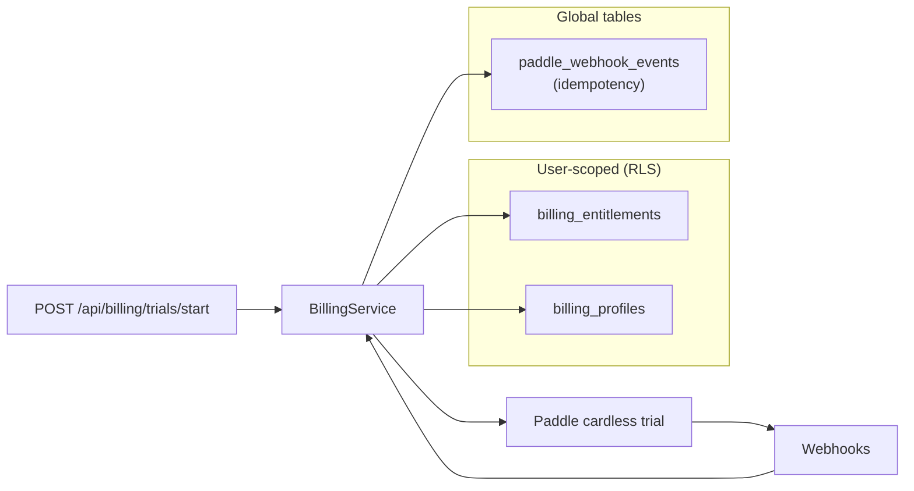
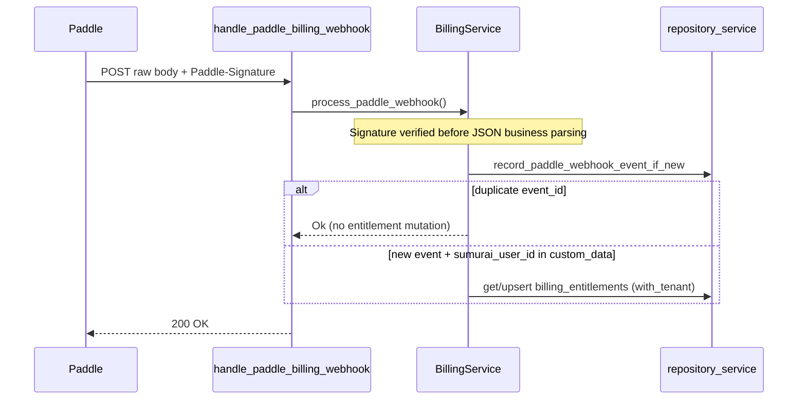
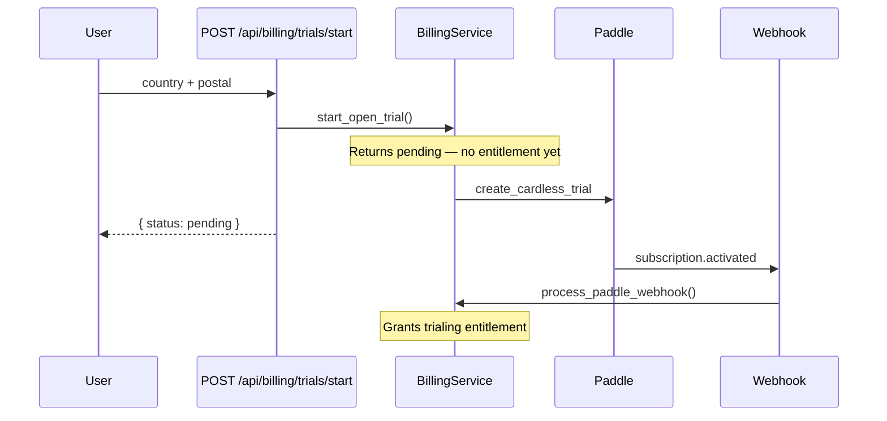

# Production Billing

Production-only Paddle billing for the hosted Sumurai deployment. Paid options apply **only** when the backend runs through `docker-compose.prod.yml` with `BILLING_MODE=paddle`.

Development (`docker-compose.dev.yml`), the default OSS stack (`docker-compose.yml`), local Next.js dev, and test environments keep billing disabled. Those environments must not show billing cards, upgrade buttons, trial-code inputs, paid labels, payment-required locks, or payment-related empty states. In-app Paddle subscription UI is currently deferred; the backend billing APIs and entitlement gates remain.

See also [PRODUCTION_TLS.md](PRODUCTION_TLS.md) for certificate provisioning on the same stack.

## Scope

| Environment | Billing | Financial providers |
| ----------- | ------- | ------------------- |
| `docker-compose.prod.yml` | Paddle enabled | DIY and Plaid only |
| `docker-compose.yml` (OSS) | Disabled | All registered providers |
| `docker-compose.dev.yml` | Disabled | All registered providers |
| Local `bun run dev` | Disabled | All registered providers |

In production billing mode:

- New accounts stay in demo mode until the user connects own data with a current entitlement.
- Paid or trialing entitlement unlocks own-data writes (Plaid link, DIY institution create, import, sync, and non-demo resource edits).
- Expired, canceled, paused, or past-due entitlement blocks own-data writes but keeps tenant data available for read, export, disconnect, and account deletion.

## Paddle configuration

Set these in the host `.env` referenced by `docker-compose.prod.yml`. `BILLING_MODE` and `ENABLED_FINANCIAL_PROVIDERS` are fixed in the compose file; the variables below must be supplied by the operator.

| Variable | Required in prod | Purpose |
| -------- | ---------------- | ------- |
| `PADDLE_ENVIRONMENT` | Yes | `production` or `sandbox` (compose sets `production`) |
| `PADDLE_API_KEY` | Yes | Paddle Billing API key |
| `PADDLE_WEBHOOK_SECRET` | Yes | Secret for `Paddle-Signature` HMAC verification |
| `PADDLE_MONTHLY_PRICE_ID` | Yes | $8/month paid subscription price ID |
| `PADDLE_CLIENT_TOKEN` | Yes | Public client-side token used to initialize Paddle.js |
| `PADDLE_CARDLESS_TRIAL_PRICE_ID` | When trials enabled | Cardless trial price ID (`trial_period.requires_payment_method = false`). Required if `BILLING_TRIALS_ENABLED=true`; optional otherwise. |
| `BILLING_TRIALS_ENABLED` | No (defaults `false`) | When `true`, allows `POST /api/billing/trials/start` (early access). When `false`, new trial starts return `TRIALS_DISABLED`. |

`BILLING_MODE` defaults to `disabled` when unset. Only `docker-compose.prod.yml` sets `BILLING_MODE=paddle`.

`ENABLED_FINANCIAL_PROVIDERS=diy,plaid` is set only in production compose. Teller and SimpleFIN are omitted from the provider catalog and return `403 PROVIDER_DISABLED` on direct API calls even when credentials exist.

Placeholder names and comments live in [`.env.example`](../.env.example). Do not commit real secrets.

## Cardless trials prerequisite

Paddle cardless trials are early access. Before enabling trials:

1. Enable cardless trials on the Paddle account.
2. Create a price with `trial_period.requires_payment_method = false`.
3. Use that price ID for `PADDLE_CARDLESS_TRIAL_PRICE_ID`.
4. Set `BILLING_TRIALS_ENABLED=true` for early access; leave `false` (or unset) for live with no new trials.

Trials are created through the Paddle API (not Paddle Checkout). The server creates or reuses customer and address records, creates a transaction, and access is granted from verified webhook fulfillment—not from the start response.



References:

- [Cardless trials](https://developer.paddle.com/build/trials/cardless-trials/)
- [Create transaction](https://developer.paddle.com/api-reference/transactions/create-transaction/)

## Webhook setup

Register a Paddle webhook endpoint pointing at:

```text
https://<DOMAIN>/api/billing/webhooks/paddle
```

Requirements:

- Use the exact raw request body for signature verification.
- Send the `Paddle-Signature` header; the backend rejects missing, stale, or mismatched signatures before JSON parsing.
- Configure the webhook secret to match `PADDLE_WEBHOOK_SECRET`.

Subscribe at minimum to these event types:

- `transaction.completed`
- `subscription.created`
- `subscription.updated`
- `subscription.activated`
- `subscription.paused`
- `subscription.canceled`
- Payment or transaction failure events that move a subscription to past-due or blocked status

Duplicate Paddle event IDs are deduplicated; out-of-order older events do not downgrade newer entitlement when `last_event_at` is newer.



Reference: [Webhook signature verification](https://developer.paddle.com/webhooks/about/signature-verification/)

## Open trial start

There is no Sumurai invite trial-code inventory or CLI. Early-access trials start through the authenticated API:

```bash
curl -X POST https://<DOMAIN>/api/billing/trials/start \
  -H 'Content-Type: application/json' \
  -H 'Cookie: auth_token=...' \
  -d '{"country_code":"US","postal_code":"78701"}'
```



Once-per-user: a second start is rejected if the account already has a non-demo entitlement. When `BILLING_TRIALS_ENABLED=false`, start returns `404` with code `TRIALS_DISABLED`.

## API surface

Authenticated billing routes (production mode):

| Method | Path | Purpose |
| ------ | ---- | ------- |
| GET | `/api/billing/status` | Billing enabled flag, `trials_enabled`, access status, provider allowlist |
| POST | `/api/billing/checkout` | Create Paddle checkout for monthly paid plan |
| POST | `/api/billing/trials/start` | Start open cardless trial (country + postal code, no card) |
| POST | `/api/billing/payment-method` | Add payment method during cardless trial |
| POST | `/api/billing/portal-session` | Temporary Paddle customer portal links (not cached) |

When billing is disabled, `GET /api/billing/status` returns `billing_enabled: false` and `access_status: unrestricted`. Mutation endpoints and the webhook return `404` with code `BILLING_DISABLED`.

Own-data write routes in production billing mode return `402` with code `PAID_ACCESS_REQUIRED` when entitlement is missing or blocked. Provider allowlist violations return `403` with code `PROVIDER_DISABLED`.

OpenAPI: [docs/OPENAPI.json](OPENAPI.json) (Billing tag, `ApiErrorResponse.code` on error responses).

## Data retention after cancellation or expiry

When paid or trial access ends:

- User financial data remains tenant-isolated in PostgreSQL.
- Read, export, disconnect, and account deletion stay available.
- Own-data writes (connect, sync, import, create institution, edit non-demo resources) stay blocked until access is restored through Paddle.

Customer portal session URLs are generated on demand and are not stored by Sumurai.

## Deployment checklist

1. Provision TLS per [PRODUCTION_TLS.md](PRODUCTION_TLS.md).
2. Set Paddle secrets in host `.env`.
3. Confirm cardless trial price exists in Paddle.
4. Set `BILLING_TRIALS_ENABLED` for early access (`true`) or live (`false`).
5. Register the webhook URL and required event types.
6. Start the stack: `DOMAIN=<domain> docker compose -f docker-compose.prod.yml up -d`
7. Verify `GET /api/billing/status` returns `billing_enabled: true` when authenticated.
8. Verify OSS/dev stacks still return `billing_enabled: false`.
