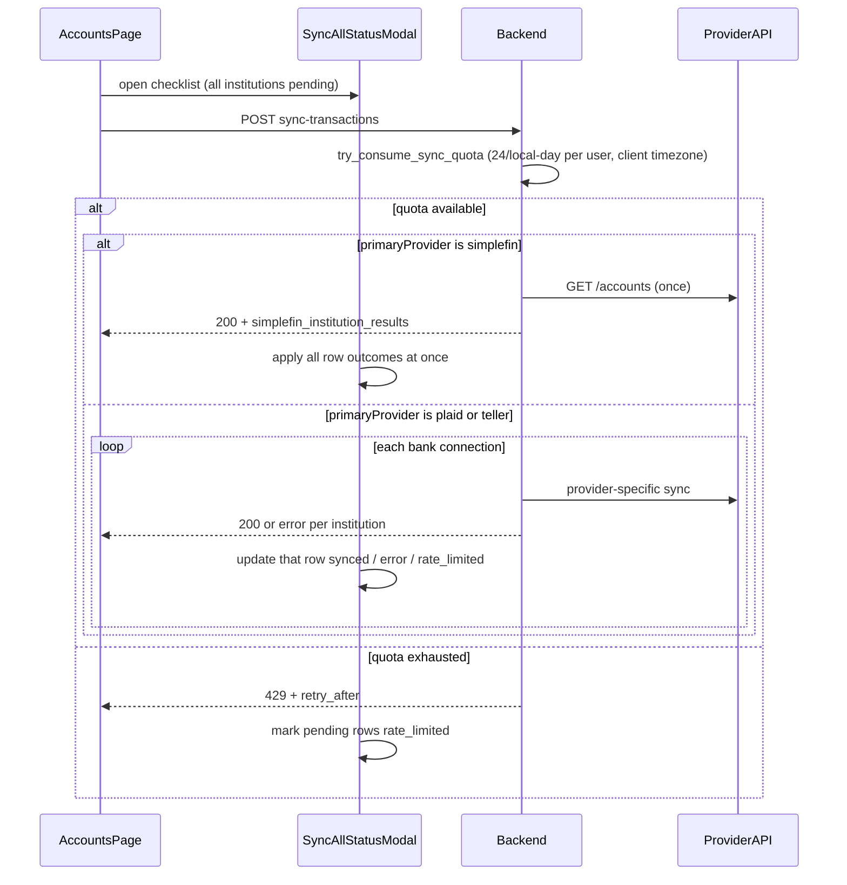

# Sync-All UX, SimpleFIN Quota, and FK Fix — Phased Plan

## Summary

Improve the **Sync all** button on Accounts for every provider: a shared read-only checklist modal with per-institution rows, provider-appropriate sync orchestration, and clear actionable copy. Backend work adds a **24 sync requests per user per local calendar day** quota applied **uniformly to Plaid, Teller, and SimpleFIN**, fixes SimpleFIN **FK violations** on connection upsert, and replaces SimpleFIN N-bridge-call sync-all with **one `GET /accounts`** per sync action.

Today Plaid/Teller sync-all loops one API call per institution (correct for those providers) but only shows a single toast with no per-row status, and there is **no shared daily sync quota** on those paths. On Accounts, **Sync all is available for SimpleFIN**, but **per-institution sync is not** — `syncDisabledForAll` hides the bank-card sync control and `syncBank` no-ops when `primaryProvider === 'simplefin'`. SimpleFIN alone has a binary 1-hour Redis floor that blocks all institutions after any sync; SimpleFIN sync-all still loops N API calls (one per org row) even though the bridge is one token. Auth warnings are parsed but not surfaced in batch UX; account upserts fail with `fk_accounts_provider_connection` when a connection row is upserted by `item_id`.

## Provider sync model

| Provider | Connections in DB | Sync-all API pattern | Quota consumption | Checklist rows |
|----------|-------------------|----------------------|-------------------|----------------|
| **Plaid** | One `provider_connection` per institution | **N calls** — one `syncTransactions(connection_id)` per bank | **1 slot per call** (shared user pool) | One row per institution; update as each call completes |
| **Teller** | One enrollment per institution | **N calls** — one `syncTransactions(connection_id)` per bank | **1 slot per call** (shared user pool) | One row per institution; update as each call completes |
| **SimpleFIN** | One bridge token underneath, but **one `provider_connection` row per org** (`persist_org_connection` saves one row per org) | **1 call** — one `GET /accounts` reconciles all orgs | **1 slot per call** (shared user pool) | One row per institution from a single response (`simplefin_institution_results`) |

Do **not** unify Plaid/Teller into a single backend call — their providers require per-item sync. Do **not** loop SimpleFIN per org connection — that burns quota and hits the rate limit incorrectly.

**Shared quota:** Every successful `POST sync-transactions` (any provider) consumes **one** slot from the same user-scoped daily counter. Example: Plaid sync-all with 3 institutions uses 3 of 24 slots. SimpleFIN sync-all uses 1 slot regardless of institution count.

The **Sync all** control in [`AccountsPage.tsx`](../frontend/src/views/AccountsPage.tsx) is the single entry point for all providers (including SimpleFIN today). **Per-institution sync** on each bank card is disabled for SimpleFIN via `syncDisabledForAll`; this work enables it and wires both flows through the shared modal orchestrator.

**SimpleFIN connection_id note:** because SimpleFIN persists one `provider_connection` row per org, the single sync HTTP call still flows through `AuthorizedConnectionRequest<SyncTransactionsRequest>` (which resolves exactly one `connection_id`). The frontend sends the **primary SimpleFIN connection row's id** (first/canonical row); the backend reconciles **all** orgs from that row's bridge token via one `GET /accounts`. See "Sync-all authorization" risk for the optional scope flag.

## Target flow

**One Sync all click → one modal → provider-appropriate orchestration.** SimpleFIN: one bridge call, all rows from one response. Plaid/Teller: N calls (one per institution), rows advance sequentially or in parallel with isolated per-row errors (one failure does not abort the rest).

## Assumptions

- User has one **primary provider** on Accounts (`primaryProvider` from catalog); sync-all never mixes Plaid + Teller + SimpleFIN in one action.
- **Daily sync quota is user-scoped and provider-agnostic:** 24 successful sync HTTP requests per **local calendar day** (user's timezone) across Plaid, Teller, and SimpleFIN combined — **never UTC** for bucket boundaries, TTL, `Retry-After`, or user-facing copy.
- **Client supplies local context on every sync request:** extend existing `client_date` (already local via `toLocaleDateString('en-CA')` in [`syncTransactionsRequest.ts`](../frontend/src/utils/syncTransactionsRequest.ts)) with `client_timezone` (IANA, e.g. `America/Chicago` from `Intl.DateTimeFormat().resolvedOptions().timeZone`). Backend validates timezone and derives day bucket + seconds-until-local-midnight from these fields.
- **Making `client_timezone` required is a breaking change — migrate first.** `client_date` is currently `Option<String>` ([`plaid.rs:63`](../backend/src/models/plaid.rs)) and the handler tolerates its absence ([`main.rs:2225`](../backend/src/main.rs)). All three frontend services (`PlaidService`, `TellerService`, `SimpleFinService`) already route through `buildSyncTransactionsRequest`, so the live client surface is covered — **but** existing backend integration-test fixtures send `client_date: None` ([`integration_tests.rs:1621,1659`](backend/src/tests/integration_tests.rs)) and must be updated in the same change, and any non-helper sync caller (e.g. post-connect/restore auto-sync) must be verified to route through the helper before the field is enforced, or those syncs will start returning 400.
- SimpleFIN bridge docs expect **≤24 `GET /accounts` requests per day**; the shared limit aligns SimpleFIN with that guidance while giving Plaid/Teller the same cap.
- Plaid/Teller retain **one sync HTTP request per institution**; the modal is the UX improvement, not a backend consolidation.
- Frontend `api.ts` types are hand-maintained and mirrored from regenerated OpenAPI (no codegen).
- Tests are boundary-only in existing test folders ([`backend/src/tests/`](backend/src/tests/), [`frontend/tests/`](frontend/tests/)).
- Re-auth link for SimpleFIN users: `https://beta-bridge.simplefin.org/my-account`.
- **Partial local WIP exists in [`simplefin_rate_limit_service.rs`](../backend/src/services/simplefin_rate_limit_service.rs) but is NOT a working base — treat it as scaffolding to rewrite, not extend.** Two reasons: (1) it calls `cache_service.get_counter()` / `increment_counter()` ([lines 31,60](../backend/src/services/simplefin_rate_limit_service.rs)) which **do not yet exist** on `CacheService` ([only `set_with_ttl`/`get_string` are defined](../backend/src/services/cache_service.rs)), so the branch **does not currently compile**; (2) `try_consume_sync_quota` has **zero production call sites** — it is constructed and injected at [`main.rs:340`](../backend/src/main.rs) but never invoked. The rate limiting that actually runs today is the binary `simplefin_sync_floor` key (written in [`connection_service.rs:1420`](../backend/src/services/connection_service.rs), checked in [`simplefin_connection_service.rs:153`](../backend/src/services/simplefin_connection_service.rs)). **Generalize and rename** to a provider-agnostic service; delete the SimpleFIN-only naming, hourly limits, and the UTC bucket/TTL helpers.

## Risks

- **Quota semantics:** Blocking on the 25th sync in the user's **local** day may surprise power users; `Retry-After` until **local midnight** must be accurate and surfaced in modal copy for **all providers** (formatted in the browser's locale/timezone, not UTC). Plaid/Teller sync-all with many institutions can exhaust quota mid-batch — remaining rows must show `rate_limited`, not a generic failure.
- **Timezone edge cases:** User traveling across timezones may shift day boundaries; accept client-sent `client_date` + `client_timezone` as source of truth per request. Reject or 400 on invalid/missing timezone rather than silently falling back to UTC.
- **Sync-all authorization:** Existing sync endpoint requires a `connection_id`; backend must reconcile the full bridge snapshot while still passing auth middleware — prefer optional scope flag on existing request over a new route for v1.
- **FK fix ripple:** Changing `save_provider_connection` return type touches trait, mocks, and all callers — update mock expectations in [`simplefin_service_tests.rs`](../backend/src/tests/simplefin_service_tests.rs) and [`connection_service_tests.rs`](../backend/src/tests/connection_service_tests.rs).
- **`ProviderSyncError::RateLimited` ripple:** the variant is currently `RateLimited(Option<String>)`, not a plain message. Converting it to `{ message, retry_after_secs }` touches every match/construction site: [`sync_service_dispatcher.rs:165`](../backend/src/services/sync_service_dispatcher.rs), [`simplefin_connection_service.rs:161` and `:274`](../backend/src/services/simplefin_connection_service.rs), and [`simplefin_service_tests.rs:1242`](../backend/src/tests/simplefin_service_tests.rs).
- **Dispatcher `Retry-After` type:** the field is `retry_after_secs: Option<&'static str>` ([`sync_service_dispatcher.rs:141,178`](../backend/src/services/sync_service_dispatcher.rs)). Passing a runtime value forces changing it to an owned `String` and adjusting the `RETRY_AFTER` header construction — not just swapping the literal `"3600"`.
- **OpenAPI drift:** New optional fields on `SyncTransactionsResponse` require regenerating [`docs/OPENAPI.json`](OPENAPI.json) and mirroring [`frontend/src/types/api.ts`](../frontend/src/types/api.ts).
- **Modal auto-dismiss:** Timer must only start after the last success row (including stagger); any warning/auth/rate-limit/error row must block auto-dismiss to avoid hiding actionable state.
- **Plaid/Teller partial failure:** Sync-all must continue after a per-institution error and show which rows failed; avoid a single global toast that hides partial success (same policy as SimpleFIN mixed auth).
- **Provider hook duplication:** [`usePlaidLinkFlow.syncAll`](../frontend/src/features/plaid/hooks/usePlaidLinkFlow.ts), [`useTellerLinkFlow.syncAll`](../frontend/src/hooks/useTellerLinkFlow.ts), and [`useSimpleFinFlow.syncAll`](../frontend/src/features/simplefin/hooks/useSimpleFinFlow.ts) each loop connections today — AccountsPage should own sync-all orchestration + modal; provider hooks keep `syncOne` for single-bank actions.

## Out of scope (follow-up)

- Dedicated `/providers/simplefin/sync-bridge` route (same handler logic, cleaner API later).

---

## Phase 1 — Backend quota (all providers), 429, and FK fix

**Goal:** Enforce a shared daily sync quota for Plaid, Teller, and SimpleFIN; remove the SimpleFIN-only 1-hour floor; return dynamic `Retry-After` on 429; ensure account upserts reference the canonical `provider_connections.id`.

**Tasks:**

- Generalize [`simplefin_rate_limit_service.rs`](../backend/src/services/simplefin_rate_limit_service.rs) → **`ProviderSyncRateLimitService`** (or `SyncRateLimitService`): daily-only counter (default 24, env `SYNC_DAILY_LIMIT`); Redis key `provider_sync:day:{user_id}:{local_date}` where `local_date` is the request's `client_date`; counter TTL = seconds until **local midnight** in `client_timezone`; remove hourly limit, hour-bucket key, and SimpleFIN-specific naming/messages. **Delete the existing UTC helpers `seconds_until_next_utc_hour` / `seconds_until_next_utc_day` ([lines 94-102](../backend/src/services/simplefin_rate_limit_service.rs)) and replace with a local-midnight calculation derived from `client_timezone`. Do not use `Utc::now()` for day buckets or TTL.**
- Extend [`SyncTransactionsRequest`](../backend/src/models/plaid.rs) + OpenAPI + [`frontend/src/types/api.ts`](../frontend/src/types/api.ts) with required `client_timezone: string` (IANA). Update [`buildSyncTransactionsRequest`](../frontend/src/utils/syncTransactionsRequest.ts) to always send `client_date` + `client_timezone`; all provider services use this helper.
- Add `get_counter` / `increment_counter` to [`CacheService`](../backend/src/services/cache_service.rs) trait, Redis impl, and `MockCacheService` (set TTL on first increment, same pattern as auth strike counting). **These do not exist yet — adding them is what makes the WIP rate-limit service compile.**
- Wire `try_consume_sync_quota(user_id, client_date, client_timezone)` at the **shared sync entry point** — [`sync_authenticated_provider_transactions`](../backend/src/main.rs) before dispatcher dispatch — so **every provider** hits the same gate (per HTTP request, which yields SimpleFIN = 1 slot, Plaid/Teller = 1 slot per institution). On `Limited`, return 429 with dynamic `retry_after_secs` (to local midnight) without calling the provider. **Quota policy on provider failure: the slot is consumed at the gate before dispatch, so a sync that passes the gate but then fails provider-side still burns the slot (no refund) — this is intentional; document it so it isn't read as a bug.**
- Remove SimpleFIN-only quota/floor logic: the floor **check** in [`simplefin_connection_service.rs:153-162`](../backend/src/services/simplefin_connection_service.rs) (the `simplefin_sync_floor:{user_id}` `get_string` + `RateLimited(None)`) **and** the floor **write** + helpers in [`connection_service.rs`](../backend/src/services/connection_service.rs) (`simplefin_sync_floor_key`, `simplefin_sync_floor_ttl_seconds`, the `set_with_ttl` at line 1420). Both must go — the binary floor is the rate limiter that actually runs today.
- Extend `ProviderSyncError::RateLimited` from `RateLimited(Option<String>)` to a struct variant `{ message, retry_after_secs }`; update all match/construction sites (see "RateLimited ripple" risk). Change the dispatcher's `retry_after_secs` from `Option<&'static str>` to an owned `String` and pass the dynamic value from [`sync_service_dispatcher.rs:178`](../backend/src/services/sync_service_dispatcher.rs) instead of hardcoded `"3600"`. Use provider-neutral copy: e.g. "Daily sync limit reached (24 per day). Try again tomorrow." (frontend may append a local-time hint from `Retry-After`).
- Update [`docker-compose.dev.yml`](../docker-compose.dev.yml): replace `SIMPLEFIN_SYNC_FLOOR_TTL_SECONDS` / `SIMPLEFIN_SYNC_*` with `SYNC_DAILY_LIMIT=24`; document in [`.env.example`](../.env.example). Wire service in [`main.rs`](../backend/src/main.rs) (replace `SimpleFinRateLimitService`-only wiring).
- Fix FK bug: [`save_provider_connection`](../backend/src/services/repository_service.rs) currently does `on_conflict(ItemId).update_columns([...])` **without `Id`** and uses `.exec()` returning `()` ([line 1096](../backend/src/services/repository_service.rs)), so on conflict the persisted row keeps its **original** id while the caller holds a freshly-generated in-memory `connection.id`. Change it to return the canonical `Uuid` — either `exec_with_returning` or a re-select by `item_id` after upsert (the conflict row's id is stable because `Id` is excluded from `update_columns`). Update `DatabaseRepository` trait signature (`Result<()>` → `Result<Uuid>`) + mocks.
- In [`simplefin_org_service.rs`](../backend/src/services/simplefin_org_service.rs) `persist_org_connection`, assign `connection.id = saved_id` before account upserts; audit sync path in `simplefin_connection_service.rs` for the same stale-id pattern.

**Acceptance criteria:**

- [x] Backend compiles: `CacheService::get_counter` / `increment_counter` exist on the trait, Redis impl, and `MockCacheService`, and the rate-limit service builds against them.
- [x] 24th sync in the user's **local calendar day** succeeds for **Plaid, Teller, and SimpleFIN**; 25th returns 429 with `retry_after_secs` until **local midnight** regardless of provider.
- [x] Quota counter key uses `client_date` from the request, not server UTC date; TTL is seconds-until-local-midnight in `client_timezone` (no `Utc::now()` in bucket or TTL).
- [x] Missing or invalid `client_timezone` returns 400 (no UTC fallback); existing integration-test fixtures sending `client_date: None` are updated to supply both fields.
- [x] A sync that passes the gate but fails provider-side still consumes its slot (documented, not refunded).
- [x] Quota counter is **shared across providers** (Plaid sync then Teller sync both increment the same user key for the same local day).
- [x] `CacheService` counter methods exist and are used by rate limit service.
- [x] `save_provider_connection` returns existing row id on `item_id` conflict, not the in-memory new UUID.
- [x] Re-sync when connection already exists upserts accounts without `fk_accounts_provider_connection` error.
- [x] Binary SimpleFIN 1-hour floor key is no longer written ([`connection_service.rs:1420`](../backend/src/services/connection_service.rs)) or checked ([`simplefin_connection_service.rs:153`](../backend/src/services/simplefin_connection_service.rs)).
- [x] Unit tests in rate limit service use fixed IANA timezones (not UTC-only); provider sync tests (Plaid/Teller/SimpleFIN) pass.

**TDD log**

- `cargo check -p sumurai-backend --locked`
- `cargo test -p sumurai-backend --locked provider_sync_rate_limit_tests -- --nocapture`
- `cargo test -p sumurai-backend --locked simplefin_service_tests -- --nocapture`
- `cargo test -p sumurai-backend --locked integration_tests -- --nocapture`
- `cargo test -p sumurai-backend --locked openapi_tests -- --nocapture`
- `cargo test -p sumurai-backend --locked regenerate_openapi_artifacts -- --ignored --nocapture`
- `npm --prefix frontend test -- tests/services/PlaidService.test.ts tests/services/SimpleFinService.test.ts tests/services/TellerService.test.ts`
- `cargo test -p sumurai-backend --locked`

---

## Phase 2 — SimpleFIN single-call sync API

**Goal:** One SimpleFIN backend sync returns per-institution results for the full bridge; frontend service exposes structured outcomes for the shared sync-all modal.

**Tasks:**

- Add optional `simplefin_institution_results` and `bridge_warnings` to `SyncTransactionsResponse` (defined in [`backend/src/models/transaction.rs:302`](../backend/src/models/transaction.rs), **not** `plaid.rs`), [`openapi/schemas.rs`](../backend/src/openapi/schemas.rs), regenerate [`OPENAPI.json`](OPENAPI.json), mirror in [`frontend/src/types/api.ts`](../frontend/src/types/api.ts).
- The single SimpleFIN sync call still passes through `AuthorizedConnectionRequest`, so it carries the **primary SimpleFIN `connection_id`** (one of the per-org rows) but reconciles all orgs from that bridge token; do not require a connection per org on this path.
- Define result statuses: `synced`, `auth_required`, `skipped_hidden`, `no_accounts`.
- Populate results in [`simplefin_connection_service.rs`](../backend/src/services/simplefin_connection_service.rs) from `snapshot.institutions_requiring_auth()`, hidden orgs, and txn counts after reconciliation.
- Add SimpleFIN message helpers under `frontend/src/features/simplefin/`: `SIMPLEFIN_BRIDGE_ACCOUNT_URL`, extend [`formatSimpleFinAuthRequiredToast.ts`](../frontend/src/features/simplefin/utils/formatSimpleFinAuthRequiredToast.ts).
- Add [`SimpleFinService.syncBridge()`](../frontend/src/services/SimpleFinService.ts) — one call, map `simplefin_institution_results` to modal row shape (429 as structured result, not thrown).
- Remove or delegate [`useSimpleFinFlow.syncAll`](../frontend/src/features/simplefin/hooks/useSimpleFinFlow.ts) N-call `Promise.all`; AccountsPage orchestrates SimpleFIN sync-all instead.

**Acceptance criteria:**

- [x] One SimpleFIN sync request triggers one `GET /accounts` in backend logs regardless of institution count.
- [x] 200 response includes per-institution rows with correct status and optional txn count.
- [x] Bridge auth errors appear as `auth_required` with institution name and message.
- [x] `useSimpleFinFlow.syncAll` no longer loops per connection id.
- [x] OpenAPI and `api.ts` stay aligned.

**TDD log**

- `cargo test -p sumurai-backend --locked simplefin_service_tests -- --nocapture`
- `cargo test -p sumurai-backend --locked openapi_tests -- --nocapture`
- `cargo test -p sumurai-backend --locked regenerate_openapi_artifacts -- --ignored --nocapture`
- `npm --prefix frontend test -- tests/services/SimpleFinService.test.ts tests/features/simplefin/hooks/useSimpleFinFlow.test.tsx`
- `cargo test -p sumurai-backend --locked`

---

## Phase 3 — Shared sync-all modal and Accounts wiring

**Goal:** The **Sync all** button on Accounts opens one provider-aware checklist modal for Plaid, Teller, and SimpleFIN; enable per-institution sync on bank cards for SimpleFIN (currently disabled).

**Tasks:**

- Add shared sync-all UI under `frontend/src/features/sync/` (not SimpleFIN-only):
  - `types/syncAllStatus.ts` — row status enum (`pending`, `syncing`, `synced`, `auth_required`, `rate_limited`, `error`, `skipped_hidden`) + row view model
  - `utils/buildSyncAllRows.ts` — seed rows from `banks` on AccountsPage
  - `utils/formatSyncAllRowDetail.tsx` — provider-specific detail copy (auth/re-auth messages; **shared `rate_limited` copy for all providers**)
  - `hooks/useSyncAllOrchestrator.ts` — branches on `primaryProvider`:
    - **simplefin:** call `SimpleFinService.syncBridge()` once; apply all row updates from response
    - **plaid:** loop `PlaidService.syncTransactions` per bank; update row on each settle; on 429 stop loop and mark remaining rows `rate_limited`; continue on other per-institution errors
    - **teller:** loop `TellerService.syncTransactions` per bank; same partial-failure and mid-batch quota policy
  - `components/SyncAllStatusModal.tsx` — Modal + GlassCard pattern from [`DisconnectModal.tsx`](../frontend/src/components/DisconnectModal.tsx)
- SimpleFIN-only pieces stay in `frontend/src/features/simplefin/` (bridge URL constant, auth message helper) and are imported by the shared formatter.
- Refactor [`AccountsPage.tsx`](../frontend/src/views/AccountsPage.tsx):
  - Replace inline toast-only `syncAll` with modal + orchestrator hook
  - Remove `syncDisabledForAll={primaryProvider === 'simplefin'}`
  - Implement `syncBank` for SimpleFIN (single bridge sync; highlight matching row or run scoped sync via same bridge call)
  - Reuse modal after connect/restore when a post-connect sync runs
- Align provider hook `syncAll` helpers with AccountsPage (delegate to shared orchestrator or deprecate in favor of page-level sync-all only).
- Error policy (all providers): modal owns batch messaging; no global failure toast when some rows succeed; optional summary toast only for total network/5xx failure.

**Acceptance criteria:**

- [ ] **Sync all** works for Plaid, Teller, and SimpleFIN from the same Accounts button.
- [ ] Plaid/Teller: N backend sync calls for N institutions; modal rows update per institution; one institution failing does not stop the rest; **429 mid-batch** marks remaining rows `rate_limited`.
- [ ] SimpleFIN: one backend call; modal shows all institution rows from `simplefin_institution_results`.
- [ ] **`rate_limited` copy is identical across providers** (daily limit + retry after **local** midnight / "tomorrow", honoring `Retry-After`; never say "UTC").
- [ ] Per-bank sync enabled for SimpleFIN (remove `syncDisabledForAll`; implement `syncBank` for SimpleFIN).
- [ ] SimpleFIN `auth_required` rows show bridge link; Plaid `needs_reauth` / Teller errors show provider-appropriate copy.
- [ ] Full success auto-closes modal after last row success + delay; any warning/error/rate-limit requires manual dismiss.
- [ ] Mixed outcomes show per-row status without a misleading global "sync failed" toast.

---

## Phase 4 — Tests and validation

**Goal:** Lock behavior with boundary tests and document manual verification.

**Tasks:**

- Backend: rate-limit unit tests with explicit IANA timezones and local-midnight TTL; FK re-sync regression in `simplefin_service_tests.rs`; Plaid/Teller sync 429 tests; `client_timezone` validation tests; update mock signatures for `save_provider_connection`.
- Frontend: extend `buildSyncTransactionsRequest` tests for `client_timezone`; `useSyncAllOrchestrator.test.ts` (Plaid partial failure + mid-batch 429, SimpleFIN single-call 429, Teller sequential); shared rate-limit message formatter uses local time formatting.

**Acceptance criteria:**

- [ ] `cargo test -p sumurai-backend --locked provider_sync_rate_limit simplefin_service_tests` (or equivalent renamed module) passes.
- [ ] `npm --prefix frontend test -- tests/features/sync/ tests/services/SimpleFinService.test.ts` passes.
- [ ] Manual Plaid/Teller: 2+ institutions — N sync calls in network tab; modal shows per-row progress; exhaust quota mid sync-all — completed rows succeed, rest show `rate_limited`.
- [ ] Manual SimpleFIN: 3+ institutions — one `GET /accounts` in logs; modal shows mixed rows; 25th sync in the **same local day** returns 429 on any provider.

---

## Next actions (student agent)

1. Read [`docs/ARCHITECTURE.md`](ARCHITECTURE.md) caching/auth sections and [`.agents/skills/sumurai-backend-architecture/SKILL.md`](../.agents/skills/sumurai-backend-architecture/SKILL.md) before backend edits.
2. Phase 2 is complete; implement **Phase 3** (shared sync-all modal + AccountsPage orchestrator).
3. Run Phase 4 validation for all three providers.
4. Do not collapse Plaid/Teller into one backend call; do not loop SimpleFIN per org connection; do not add a new sync route; do not use per-provider quota counters; **do not use UTC for daily quota boundaries or user-facing retry copy**.

## Key files

| Area | Path |
|------|------|
| Sync request (local date + tz) | [`frontend/src/utils/syncTransactionsRequest.ts`](../frontend/src/utils/syncTransactionsRequest.ts), [`backend/src/models/plaid.rs`](../backend/src/models/plaid.rs) `SyncTransactionsRequest` |
| Sync response (new fields) | [`backend/src/models/transaction.rs`](../backend/src/models/transaction.rs) `SyncTransactionsResponse`, [`backend/src/openapi/schemas.rs`](../backend/src/openapi/schemas.rs), [`frontend/src/types/api.ts`](../frontend/src/types/api.ts) |
| CacheService counters (new) | [`backend/src/services/cache_service.rs`](../backend/src/services/cache_service.rs) `get_counter` / `increment_counter` |
| Sync all entry | [`frontend/src/views/AccountsPage.tsx`](../frontend/src/views/AccountsPage.tsx) |
| Shared modal (new) | `frontend/src/features/sync/` |
| Rate limit (generalize from WIP) | [`backend/src/services/simplefin_rate_limit_service.rs`](../backend/src/services/simplefin_rate_limit_service.rs) → provider-agnostic service |
| Sync handler (quota gate) | [`backend/src/main.rs`](../backend/src/main.rs) `sync_authenticated_provider_transactions` |
| SimpleFIN sync path | [`backend/src/services/simplefin_connection_service.rs`](../backend/src/services/simplefin_connection_service.rs) |
| FK / repository | [`backend/src/services/repository_service.rs`](../backend/src/services/repository_service.rs), [`simplefin_org_service.rs`](../backend/src/services/simplefin_org_service.rs) |
| 429 dispatch | [`backend/src/services/sync_service_dispatcher.rs`](../backend/src/services/sync_service_dispatcher.rs) |
| Auth parsing | [`backend/src/models/simplefin.rs`](../backend/src/models/simplefin.rs) |
| Provider hooks (syncOne only after refactor) | [`usePlaidLinkFlow.ts`](../frontend/src/features/plaid/hooks/usePlaidLinkFlow.ts), [`useTellerLinkFlow.ts`](../frontend/src/hooks/useTellerLinkFlow.ts), [`useSimpleFinFlow.ts`](../frontend/src/features/simplefin/hooks/useSimpleFinFlow.ts) |
