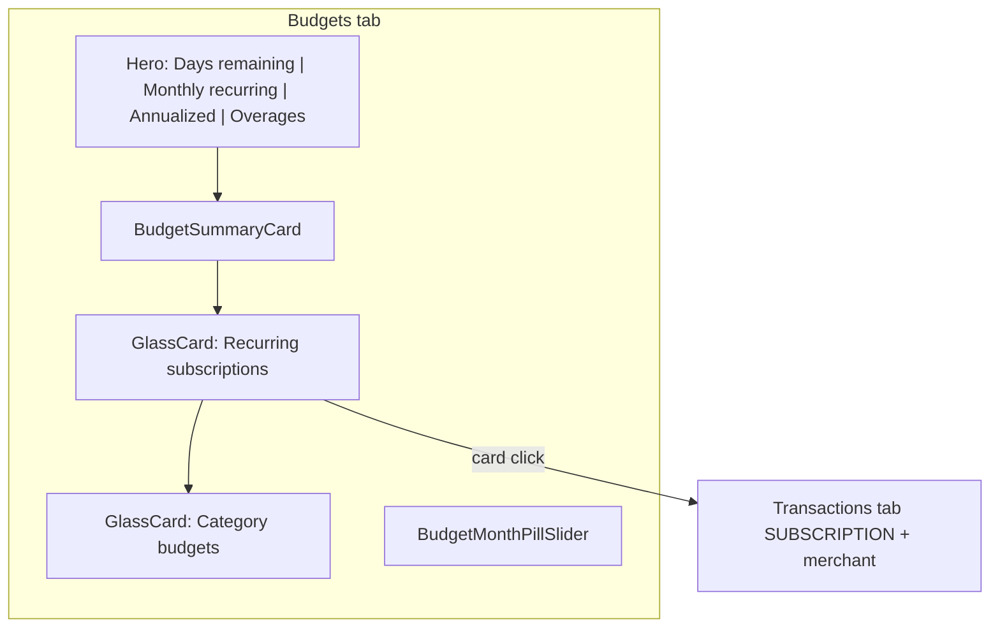
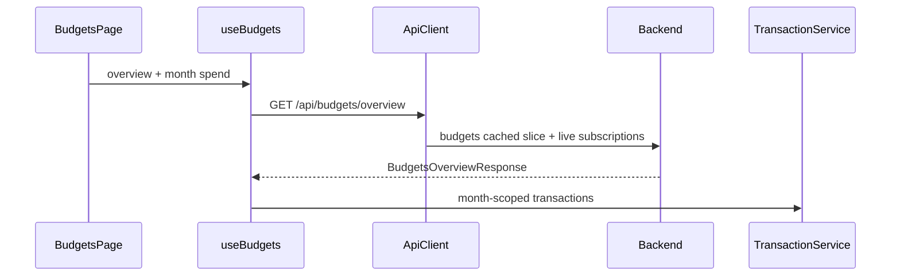

# Subscriptions on Budgets Page — MPRD

## Summary

Subscriptions were implemented as a standalone tab (Phase 6 of [SUBSCRIPTIONS_PLAN.md](SUBSCRIPTIONS_PLAN.md)). The intended UX is a **single Budgets page**: subscription insights in the hero row, a recurring-subscriptions card above category budgets, and no top-level Subscriptions tab.

**API first:** ship `GET /api/budgets/overview` before UI composition so the page has one server contract from the start.

## Key design decisions (locked)

| Decision | Choice | Rationale |
|----------|--------|-----------|
| Frontend hook | **Extend `useBudgets` in-place** | Mutations already use `queryKey: ['budgets']` with optimistic updates; [`queryInvalidation.ts`](frontend/src/utils/queryInvalidation.ts) invalidates `['budgets']` on sync/categorization — not `['subscriptions']` today |
| React Query key | Keep `['budgets']` | Overview payload replaces flat `Budget[]` in cache; mutations update `data.budgets` slice |
| Separate `useBudgetsOverview` | No | Avoids two hooks on one page and duplicate invalidation wiring |
| `GET /api/budgets` | Keep (additive) | Overview is new; list endpoint stays for backward compat until explicitly removed |
| `GET /api/subscriptions` | Remove after Phase 4 | Only consumer is Subscriptions tab; grep before delete |
| Overview errors | Page-level via `PageLayout` | Single endpoint → single load/error state; no split subscription vs budget errors |
| Implementation template | [`balances_overview_api_tests.rs`](backend/src/tests/balances_overview_api_tests.rs) | Existing overview + cache pattern in this repo |

## Assumptions

- `SUBSCRIPTION` remains a system category in picker, filters, and transactions.
- Subscription detection repo logic and seed scenarios are reused inside the overview handler (`get_subscription_summary`).
- Month slider scopes **category budgets only**; subscription heroes and merchant list use **all-time detected recurring** data.
- Month-scoped spend for budget progress still comes from client-side transaction fetch in `useBudgets` (not part of overview).
- Design system: compose with existing primitives (`GlassCard`, `HeroStatCard`, `PageLayout`, recipes/tokens per `.agents/skills/sumurai-frontend-design-system/SKILL.md`).

## Risks

- **Mutation/cache type parameter change** — every `queryClient.setQueryData<Budget[]>` / `getQueryData<Budget[]>` call in the three mutation handlers (`add`, `update`, `remove`) must become `BudgetsOverviewResponse`; easy to miss in Phase 2.
- **`useBudgets.test.tsx` mock shape** — the existing test file mocks `Budget[]` at `['budgets']`; after Phase 2 it must supply `BudgetsOverviewResponse`; Phase 4 `BudgetsPage.test.tsx` also extends this mock with `subscriptions`.
- **Storybook CI smoke** — `BudgetsScreenSlice.tsx` hardcodes "Active budgets" and "Monitor" hero titles; CI builds and runs iframe smoke tests on every PR, so the slice must be updated in Phase 4 (not Phase 5) to avoid a CI failure on that PR.
- **Stale subscriptions after sync** — mitigated by live `get_subscription_summary` per overview request + `['budgets']` invalidation on sync (already wired).
- **OpenAPI / `api.ts` drift** — handler must ship with regenerated artifacts.

## Target layout

## Data flow (after Phase 2)

---

## Phase 1 — Budgets overview API (backend)

**Goal:** Establish the combined read endpoint and contract before any merged UI work.

**Tasks:**
- Add `BudgetsOverviewResponse { budgets: Vec<Budget>, subscriptions: Vec<SubscriptionSummary> }` to `backend/src/models/budget.rs` (alongside existing `Budget`, `CreateBudgetRequest`, etc.).
- Add `GET /api/budgets/overview` handler in `main.rs` following the existing `get_authenticated_budgets` cache pattern:
  - Check Redis cache (`get_budgets` / JWT id); on **hit**, call `get_subscription_summary` live and return combined payload (one DB call).
  - On **miss**, `tokio::join!(budget_service.get_budgets_for_user(...), db_repository.get_subscription_summary(...))`, then cache the budgets slice and return both.
  - `tokio::join!` applies only on the cache-miss DB fallback path, not across the cache check.
- Register OpenAPI path/schema; regenerate `backend/openapi/` and `docs/OPENAPI.json`.
- Mirror response type in `frontend/src/types/api.ts`.
- Add backend integration test modeled on `balances_overview_api_tests.rs` (auth, payload shape, budgets cache hit path).
- Keep `POST/PUT/DELETE /api/budgets/{id}` unchanged; `clear_budgets` continues to invalidate budgets cache.

**Acceptance criteria:**
- [x] `GET /api/budgets/overview` returns `{ budgets, subscriptions }` for authenticated user (RLS-scoped).
- [x] Subscriptions are fetched live on every overview request.
- [x] OpenAPI regenerated; `api.ts` mirrors response shape.
- [x] Backend integration test covers overview handler.
- [x] Budget CRUD and cache invalidation behavior unchanged.

**TDD log (Phase 1):**
- Red: `budgets_overview_api_tests.rs` — cache miss + cache hit paths (route missing).
- Green: `BudgetsOverviewResponse`, `get_authenticated_budgets_overview`, route + OpenAPI registration.
- `cargo test -p sumurai-backend --locked budgets_overview` — 2 passed.
- `cargo test -p sumurai-backend --locked budget_api` — 13 passed (CRUD unchanged).
- `cargo test -p sumurai-backend --locked regenerate_openapi_artifacts -- --ignored` — OPENAPI.json updated.
- `npm --prefix frontend run typecheck` — passed.

---

## Phase 2 — Extend `useBudgets` data layer

**Goal:** Single fetch for budgets + subscriptions; preserve mutation and invalidation behavior.

**Tasks:**
- Add static `BudgetService.getOverview()` → `/budgets/overview` via `ApiClient` on the existing `BudgetService` class (matching `getBudgets`, `createBudget` pattern).
- Change `useBudgets` `budgetsQuery` to call `BudgetService.getOverview()`; expose `subscriptions: SubscriptionSummary[]` on `UseBudgetsResult`.
- Keep `budgets` derived from `overview.budgets` so downstream `computedBudgets` logic is unchanged.
- Update all three mutation optimistic handlers: change `queryClient.setQueryData<Budget[]>` / `getQueryData<Budget[]>` to `BudgetsOverviewResponse` and target `data.budgets` slice (not root array).
- Keep `queryKey: ['budgets']` — no change to [`queryInvalidation.ts`](frontend/src/utils/queryInvalidation.ts) required.
- Add `frontend/src/domain/SubscriptionCalculator.ts` with `computeSubscriptionHeroStats(summaries: SubscriptionSummary[])` returning `{ monthlyTotal, annualized }` (following `BudgetCalculator` pattern in the same folder).
- Update existing `frontend/tests/features/budgets/hooks/useBudgets.test.tsx` — mock data must change from `Budget[]` to `BudgetsOverviewResponse`; add assertions that `subscriptions` is exposed.
- Add Bun tests: `BudgetService.getOverview()` contract; `SubscriptionCalculator` math; `useBudgets` mutation shape preserved.

**Acceptance criteria:**
- [x] `useBudgets` fetches overview; exposes `budgets` and `subscriptions`.
- [x] Add/update/remove budget mutations still work with optimistic updates.
- [x] `['budgets']` invalidation refetches overview (subscriptions refresh after sync).
- [x] Frontend boundary tests pass for overview integration in `useBudgets`.
- [x] Budgets page not required to be wired yet — hook verified in isolation.

**TDD log (Phase 2):**
- Red: `SubscriptionCalculator.test.ts`, `BudgetService.getOverview` test, `useBudgets.test.tsx` overview mocks + subscriptions assertions.
- Green: `SubscriptionCalculator`, `BudgetService.getOverview`, `useBudgets` overview query + mutation cache shape.
- `npm --prefix frontend test -- tests/domain/SubscriptionCalculator.test.ts tests/services/BudgetService.test.ts tests/features/budgets/hooks/useBudgets.test.tsx` — 22 passed.
- `npm --prefix frontend run typecheck` — passed.

---

## Phase 3 — Extract subscription UI components

**Goal:** Move subscription presentation out of the standalone view into reusable feature components.

**Tasks:**
- Create `frontend/src/features/subscriptions/components/SubscriptionList.tsx` (merchant card grid, cadence badge, click handler, empty/loading).
- Create `frontend/src/features/subscriptions/components/SubscriptionsSection.tsx` (heading, subtitle, list/empty; **no fetch** — props only).
- Reuse styling from `SubscriptionsPage.tsx` (`heroStatCardRecipes`, `getTagThemeForCategory('SUBSCRIPTION')`).
- Move/adapt tests from `SubscriptionsPage.test.tsx` → `tests/features/subscriptions/components/` **in this phase** (TDD at boundary).
- Delete `frontend/src/views/SubscriptionsPage.tsx` after extraction.

**Acceptance criteria:**
- [ ] `SubscriptionList` renders merchant cards and invokes `onSelect(merchant)` on click.
- [ ] `SubscriptionsSection` shows empty state; no duplicate hero metrics in card header.
- [ ] Component tests pass with fixture props (no `useSubscriptions` in components).
- [ ] No subscription-specific page view remains under `frontend/src/views/`.

---

## Phase 4 — Recompose Budgets page and remove Subscriptions tab

**Goal:** Single Budgets entry point with target layout, wired to extended `useBudgets`.

**Tasks:**
- Update `frontend/src/views/BudgetsPage.tsx`:
  - Add `onNavigateToTransactions(category, merchant)` prop.
  - Rebuild hero grid: **Days remaining → Monthly recurring → Annualized → Overages** (icons: `Clock`, `Repeat2`, `CalendarClock`, `AlertTriangle`).
  - Remove **Active budgets** and **Monitor** heroes and related `useMemo` (pills, utilization zone).
  - Keep `BudgetSummaryCard` below heroes.
  - `PageLayout` children: **subscriptions `GlassCard` first**, then category budgets `GlassCard`.
  - Hero slots 2–3 use `SubscriptionCalculator.computeSubscriptionHeroStats(subscriptions)`; show `—` while `isLoading`.
  - Page-level `error` from `useBudgets` covers overview failure (both cards).
- Remove `'subscriptions'` from `TabKey` in `AuthenticatedApp.tsx`, `AppLayout.tsx`, `AppTitleBar.tsx`; re-index `TABS` array in `AppTitleBar.tsx`.
- Remove subscriptions render branch; re-index `TAB_INDEX` (accounts → 3, settings → 4).
- Pass `handleNavigateToTransactions` into `BudgetsPage`.
- Restrict `BudgetMonthPillSlider` to `tab === 'budgets'` only (drop subscriptions branch).
- Update `BudgetsScreenSlice.tsx` heroes (Days remaining, Monthly recurring, Annualized, Overages) and add subscription card state in this phase — CI builds Storybook on every PR so the slice must stay aligned with the page.
- Extend `BudgetsPage.test.tsx` (mocks must supply `subscriptions` from `useBudgets`) and `AuthenticatedApp.test.tsx`.
- Stop importing/calling `useSubscriptions` and `SubscriptionService` in the Budgets page path; do **not** delete those files yet (deferred to Phase 5 after route removal).

**Acceptance criteria:**
- [ ] Hero row order and values match spec.
- [ ] Two `GlassCard`s: subscriptions above budgets.
- [ ] Card click deep-links to Transactions (`SUBSCRIPTION` + merchant).
- [ ] Month slider affects budgets only, not subscription heroes/grid.
- [ ] No Subscriptions tab in nav.
- [ ] `BudgetsPage` and `AuthenticatedApp` tests updated and passing.

---

## Phase 5 — Storybook, docs, and validation sweep

**Goal:** Visual parity, plan doc alignment, manual verification, endpoint cleanup.

**Tasks:**
- Extend [`BudgetsJourney.stories.tsx`](frontend/src/storybook/screens/user-journeys/BudgetsJourney.stories.tsx) with subscription fixtures (slice already updated in Phase 4).
- Delete `frontend/src/services/SubscriptionService.ts` and `frontend/src/features/subscriptions/hooks/useSubscriptions.ts`; remove/repurpose their Bun tests.
- Remove `GET /api/subscriptions` route + handler + OpenAPI entry after grepping confirms no remaining frontend callers; update or remove `backend/src/tests/subscription_api_tests.rs`.
- Update `docs/SUBSCRIPTIONS_PLAN.md` Phase 6 intent and Phase 8 manual checklist (Budgets tab, not Subscriptions tab).
- Run full validation: `bun --cwd=frontend test`, `cargo test -p sumurai-backend --locked`, Storybook smoke.
- Manual at `http://localhost:8080` with demo user `me@test.com`.

**Acceptance criteria:**
- [ ] Storybook budgets slice shows subscriptions card + new heroes.
- [ ] `SUBSCRIPTIONS_PLAN.md` Phase 6 and Phase 8 checklist corrected.
- [ ] Full test suites green.
- [ ] Manual check: merged layout, deep-link, month slider scoping, no Subscriptions tab.

---

## Out of scope

- Month-filtered subscription API (`?month=YYYY-MM`).
- Auto-creating a `SUBSCRIPTION` category budget from detected recurring total.
- Merging subscription total into `BudgetSummaryCard`.
- Batching transactions into overview (month spend stays client-side).
- Removing `GET /api/budgets` list endpoint (overview is additive for now).

## Next actions

1. Phase 1 — overview endpoint + backend test + OpenAPI/`api.ts`.
2. Phase 2 — extend `useBudgets` (critical: mutation cache shape).
3. Phases 3–4 — components then page + nav (can be one PR if reviewable).
4. Phase 5 — Storybook, doc updates, endpoint cleanup, manual E2E.

## Source

Consolidated from Cursor plan `subscriptions_into_budgets`, layout/hero iteration, API-first sequencing, and codebase review (June 2026).
