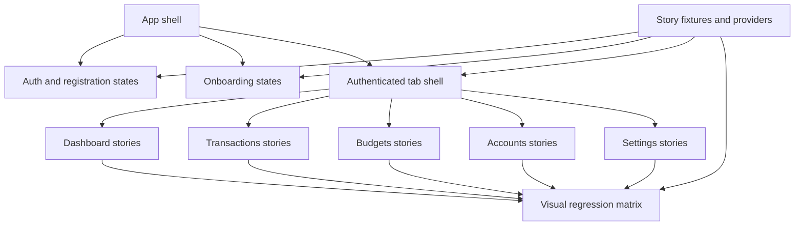

# Storybook Coverage And UI Test Plan

## Context

Current Storybook coverage is a small design-system slice: primitives, a few feature components, and one synthetic dashboard smoke story. The real app is a client-side SPA orchestrated by [`frontend/src/App.tsx`](../frontend/src/App.tsx) and [`frontend/src/components/AuthenticatedApp.tsx`](../frontend/src/components/AuthenticatedApp.tsx), with authenticated tabs for dashboard, transactions, budgets, accounts, and settings. The current visual regression spec in [`frontend/tests/visual/storybook.visual.spec.ts`](../frontend/tests/visual/storybook.visual.spec.ts) screenshots only eight hard-coded story IDs, so new stories do not automatically represent the product.

```ts
const storyIds = [
  'primitives-button--primary',
  'primitives-button--disabled',
  'primitives-glasscard--default',
  'primitives-input--invalid',
  'features-budgets-budgetsummarycard--default',
  'features-transactions-transactionstoolbar--default',
  'features-analytics-dashboardchartcard--default',
  'storybook-fullpagesmoke--dashboard-slice',
];
```

The implementation should preserve the existing design-system boundaries:

- Shared tokens stay in [`frontend/src/ui/tokens`](../frontend/src/ui/tokens).
- Reusable primitives stay in [`frontend/src/ui/primitives`](../frontend/src/ui/primitives).
- Domain UI stays in [`frontend/src/features`](../frontend/src/features) or [`frontend/src/components`](../frontend/src/components).
- Page composition stays in [`frontend/src/views`](../frontend/src/views).
- Tests stay under [`frontend/tests`](../frontend/tests).
- Story-only helpers and fixtures should live under [`frontend/src/storybook`](../frontend/src/storybook) so they do not leak into app code.
- Do not call real auth, Plaid, Teller, analytics, budget, transaction, or settings services from Storybook stories.
- Light and dark theme coverage should be representative, not exhaustive. Each major app surface should have at least one light and one dark Storybook state where theme materially changes the UI, but the visual matrix should not double every story by default.
- Use the Storybook MCP when Storybook is running. It should be used to discover story IDs, fetch story-writing guidance before editing `*.stories.*`, inspect generated docs, and produce preview URLs for representative stories.



## Phase 1: Inventory And Coverage Contract

**Status:** complete.

Goal: turn the vague complaint into a concrete coverage map before writing stories.

Implementation tasks:

- [x] Create a Storybook coverage checklist document under [`docs`](.), for example `docs/frontend-storybook-coverage-plan.md`.
- [x] Inventory all existing stories under [`frontend/src`](../frontend/src), currently including primitives, `DashboardChartCard`, `BudgetSummaryCard`, `TransactionsToolbar`, `ProviderSelectionPanel`, and [`frontend/src/storybook/FullPageSmoke.stories.tsx`](../frontend/src/storybook/FullPageSmoke.stories.tsx).
- [ ] If Storybook can be started locally, use Storybook MCP `list-all-documentation` with story IDs to cross-check the filesystem inventory and catch any stories or docs entries missed by source search.
- [x] Map real app surfaces from [`frontend/src/App.tsx`](../frontend/src/App.tsx), [`frontend/src/components/AuthenticatedApp.tsx`](../frontend/src/components/AuthenticatedApp.tsx), [`frontend/src/Auth.tsx`](../frontend/src/Auth.tsx), [`frontend/src/components/onboarding/OnboardingWizard.tsx`](../frontend/src/components/onboarding/OnboardingWizard.tsx), and the five files in [`frontend/src/views`](../frontend/src/views).
- [x] For each screen, list the minimum states Storybook must cover: default, loading, error, empty, success, disabled/in-progress, and edge/dense data where relevant.
- [x] For each screen, identify the canonical light and dark theme states. Prefer one happy-path light story and one high-value dark story per major app surface instead of duplicating every variant.
- [x] Mark which stories should enter the Playwright visual matrix, which should have behavior tests, and which are docs/manual-only. The default should be Storybook coverage first, with tests only for the most important user-visible contracts.

### Phase 1 inventory: existing story files

There are nine `*.stories.tsx` files under [`frontend/src`](../frontend/src).

| Story file | Storybook `title` | Exported stories |
|------------|-------------------|-------------------|
| [`ui/primitives/Button.stories.tsx`](../frontend/src/ui/primitives/Button.stories.tsx) | `Primitives/Button` | Primary, PrimaryInteraction, Secondary, Disabled, Loading, Connect, DarkPrimary |
| [`ui/primitives/GlassCard.stories.tsx`](../frontend/src/ui/primitives/GlassCard.stories.tsx) | `Primitives/GlassCard` | Default, Accent, DenseData, Overflow, DarkCanvas |
| [`ui/primitives/Input.stories.tsx`](../frontend/src/ui/primitives/Input.stories.tsx) | `Primitives/Input` | Default, Invalid, Glass, Disabled |
| [`ui/primitives/EmptyState.stories.tsx`](../frontend/src/ui/primitives/EmptyState.stories.tsx) | `Primitives/EmptyState` | Default, WithAction, Dark |
| [`features/analytics/components/DashboardChartCard.stories.tsx`](../frontend/src/features/analytics/components/DashboardChartCard.stories.tsx) | `Features/Analytics/DashboardChartCard` | Default, Loading, EmptyBody |
| [`features/budgets/components/BudgetSummaryCard.stories.tsx`](../frontend/src/features/budgets/components/BudgetSummaryCard.stories.tsx) | `Features/Budgets/BudgetSummaryCard` | Default, OverBudget, DenseValues |
| [`features/transactions/components/TransactionsToolbar.stories.tsx`](../frontend/src/features/transactions/components/TransactionsToolbar.stories.tsx) | `Features/Transactions/TransactionsToolbar` | Default, Filtered |
| [`features/plaid/components/ProviderSelectionPanel.stories.tsx`](../frontend/src/features/plaid/components/ProviderSelectionPanel.stories.tsx) | `Features/Plaid/ProviderSelectionPanel` | Catalogue, Loading, ErrorState, Selecting |
| [`storybook/FullPageSmoke.stories.tsx`](../frontend/src/storybook/FullPageSmoke.stories.tsx) | `Storybook/FullPageSmoke` | DashboardSlice |

Story IDs follow Storybook’s default slugging (example: `Primitives/Button` + `Primary` → `primitives-button--primary`). Use MCP `list-all-documentation` with `withStoryIds: true` when Storybook is running to capture authoritative IDs.

### Phase 1 inventory: primary app surfaces

The SPA is driven from [`App.tsx`](../frontend/src/App.tsx): bootstrap loading, unauthenticated login/register, onboarding wizard, then authenticated tabs inside [`AuthenticatedApp.tsx`](../frontend/src/components/AuthenticatedApp.tsx).

| Surface | Primary source | Minimum Storybook states | Canonical theme pair |
|---------|----------------|---------------------------|-------------------------|
| Bootstrap loading | [`App.tsx`](../frontend/src/App.tsx) | loading | light happy path + dark if chrome differs |
| Login | [`Auth.tsx`](../frontend/src/Auth.tsx) (`LoginScreen`) | default, submitting, API error | light + dark |
| Register | [`Auth.tsx`](../frontend/src/Auth.tsx) (`RegisterScreen`) | default, validation, submitting | light + dark |
| Onboarding | [`OnboardingWizard.tsx`](../frontend/src/components/onboarding/OnboardingWizard.tsx) | welcome, connect, provider loading/error, connect in progress, connected, Teller without application id | light + dark |
| Dashboard | [`views/DashboardPage.tsx`](../frontend/src/views/DashboardPage.tsx) | default, analytics loading/refreshing, empty slices, net worth error | light + dark |
| Transactions | [`views/TransactionsPage.tsx`](../frontend/src/views/TransactionsPage.tsx) | loading, empty table, rows, toolbar filtered, page error | light + dark |
| Budgets | [`views/BudgetsPage.tsx`](../frontend/src/views/BudgetsPage.tsx) | empty, list, add/edit form, validation/server error | light + dark |
| Accounts | [`views/AccountsPage.tsx`](../frontend/src/views/AccountsPage.tsx) | provider picker loading/error, connected list, sync/disconnect, toast | light + dark |
| Settings | [`views/SettingsPage.tsx`](../frontend/src/views/SettingsPage.tsx) | password validation, success path, delete modal gates/errors | light + dark |

### Phase 1 inventory: Playwright visual matrix vs Storybook

[`frontend/tests/visual/storybook.visual.spec.ts`](../frontend/tests/visual/storybook.visual.spec.ts) snapshots exactly eight story IDs (see Context block above).

Representative gaps relative to that allowlist:

- **No Playwright coverage:** entire `Primitives/EmptyState` file; entire `Features/Plaid/ProviderSelectionPanel` file; most non-default variants for primitives and features (for example `Button` beyond Primary/Disabled, `GlassCard` beyond Default, `Input` beyond Invalid, `DashboardChartCard` Loading/EmptyBody, `BudgetSummaryCard` OverBudget/DenseValues, `TransactionsToolbar` Filtered).
- **Product gaps:** no Storybook stories yet for auth screens, onboarding shell, [`AppLayout`](../frontend/src/layouts/AppLayout.tsx), [`PageLayout`](../frontend/src/layouts/PageLayout.tsx), or full tab screen slices beyond smoke composition.

Suggested classification for later phases:

| Category | Role |
|----------|------|
| Playwright visual matrix | Small stable set of IDs that protect cross-cutting regressions (primitives, one slice per feature area, representative screen slices once added). |
| Behavior tests ([`frontend/tests`](../frontend/tests)) | Representative flows only: forms, modals, pagination, provider selection, navigation. Not every story variant. |
| Storybook only | Most layout variants and dense visual states; manual or MCP preview review. |

### Representative policies (Phase 1 summary)

**Tests:** prioritize core UI contracts, critical interactions, accessibility-sensitive controls, and regressions that would confuse users or break flows. Do not add a test per Storybook variant.

**Theme:** ship both light and dark coverage across major surfaces using intentional pairs (typically one happy-path light and one high-signal dark or degraded dark per surface), not a full matrix of every state in both themes.

### Storybook MCP cross-check

Inventory in this document was produced from the repository filesystem (glob and grep on `*.stories.tsx`). Storybook MCP was **not** invoked in this automation context because a live Storybook dev server was not assumed. After `npm --prefix frontend run storybook`, run MCP `list-all-documentation` with story IDs and reconcile any discrepancy with the table above; paste authoritative IDs into future edits if they differ from slug guesses.

### Phase 1 TDD log

Phase 1 acceptance excludes changes under [`frontend/src`](../frontend/src), [`frontend/tests`](../frontend/tests), and package manifests. No red-green-refactor test slice was added. Verification: documentation-only update to [`frontend-storybook-coverage-plan.md`](./frontend-storybook-coverage-plan.md).

Acceptance criteria:

- The coverage document exists in [`docs`](.) and names every current story file plus every primary app screen.
- The document identifies the current eight visual story IDs and explicitly calls out gaps such as auth, onboarding, app shell, page layouts, accounts, settings, table/list states, and non-default variants.
- The document defines a representative test policy: do not test every story or visual variant; test only core UI contracts, critical interactions, accessibility-sensitive controls, and states that would create meaningful product regressions.
- The document defines a representative theme policy: light and dark are both covered across the product, but theme variants are selected intentionally rather than duplicated for every story.
- The document records whether Storybook MCP was available during inventory and, if available, includes story IDs discovered through MCP rather than relying only on file names.
- The student agent can use the document as a checklist without needing to rediscover the app structure.
- No source, test, or package files are changed in this phase.

## Phase 2: Story Fixtures And App Decorators

**Status:** complete.

Goal: make realistic stories easy to write without coupling Storybook to live services.

Implementation tasks:

- [x] Add story-only fixtures under [`frontend/src/storybook`](../frontend/src/storybook), grouped by domain. Initial files cover time, transactions, accounts, and budgets; add analytics, auth, providers, and settings payloads when those stories are authored.
- [x] Add a shared story decorator/provider module under [`frontend/src/storybook`](../frontend/src/storybook) that wraps stories with the same global visual context used by the app, especially `ThemeProvider` and full-screen canvas handling.
- [x] Add a theme-aware story wrapper that can force light or dark mode for deterministic Storybook and Playwright screenshots.
- [x] Prefer plain typed fixture objects using types from [`frontend/src/types/api.ts`](../frontend/src/types/api.ts).
- [x] Add helper wrappers for layout-level stories, such as unauthenticated shell, authenticated shell, and page-layout canvas.
- [x] Keep fixtures deterministic: fixed dates, fixed account names, fixed amounts, no random data, no current-time formatting unless injected.

### Phase 2 implementation notes

- [`ThemeProvider`](../frontend/src/context/ThemeContext.tsx) accepts optional `initialMode` so Storybook can pin light or dark without fighting system preference listeners.
- Storybook preview moved to [`.storybook/preview.tsx`](../frontend/.storybook/preview.tsx) with a toolbar global `theme` and a decorator that wraps stories in `ThemeProvider`.
- Typed fixtures: [`fixtures/time.ts`](../frontend/src/storybook/fixtures/time.ts), [`fixtures/transactions.ts`](../frontend/src/storybook/fixtures/transactions.ts), [`fixtures/accounts.ts`](../frontend/src/storybook/fixtures/accounts.ts), [`fixtures/budgets.ts`](../frontend/src/storybook/fixtures/budgets.ts). Layout helper: [`layout.tsx`](../frontend/src/storybook/layout.tsx) (`StoryFullscreen`). Dedicated authenticated versus unauthenticated shells stay for Phase 3 onward.
- Boundary tests: extended [`ThemeContext.test.tsx`](../frontend/tests/context/ThemeContext.test.tsx) for `initialMode`; added [`fixturesShape.test.ts`](../frontend/tests/storybook/fixturesShape.test.ts) for fixture shapes.

### Phase 2 TDD log

1. Red: `ThemeContext` test expects forced light mode via `initialMode` while matchMedia prefers dark.
2. Green: optional `initialMode` on `ThemeProvider`; skip system `prefers-color-scheme` subscription when `initialMode` is set.
3. Red: fixture smoke tests for typed exports.
4. Green: story fixtures and shape assertions under [`frontend/tests/storybook`](../frontend/tests/storybook).
5. Verify: `npm --prefix frontend run typecheck`, full `npm --prefix frontend test`, `npm --prefix frontend run storybook:build`.

Acceptance criteria:

- New story helpers live only under [`frontend/src/storybook`](../frontend/src/storybook).
- Storybook can render the new helpers through `npm --prefix frontend run storybook` without runtime service calls.
- Stories can opt into deterministic light or dark rendering without relying on manual toolbar clicks.
- Fixture data is typed and reusable by multiple stories.
- No fixture imports are introduced from production code paths outside Storybook files.
- `npm --prefix frontend run typecheck` passes.

## Phase 3: App Shell, Layout, Auth, And Onboarding Stories

**Status:** complete.

Goal: represent the first screens a user actually sees.

Implementation tasks:

- [x] Before creating or editing any `*.stories.*` file, use Storybook MCP `get-storybook-story-instructions` and apply its local guidance for story structure, imports, args, play functions, and mocks.
- [x] Add stories for [`frontend/src/ui/primitives/AppTitleBar`](../frontend/src/ui/primitives), [`frontend/src/layouts/AppLayout.tsx`](../frontend/src/layouts/AppLayout.tsx), and [`frontend/src/layouts/PageLayout.tsx`](../frontend/src/layouts/PageLayout.tsx) if they do not already have complete stories.
- [x] Add auth stories around [`frontend/src/Auth.tsx`](../frontend/src/Auth.tsx): login default, login error, login submitting, register default, register invalid email, register password requirements, and register password mismatch.
- [x] Add onboarding stories around [`frontend/src/components/onboarding/WelcomeStep.tsx`](../frontend/src/components/onboarding/WelcomeStep.tsx), [`frontend/src/components/onboarding/ConnectAccountStep.tsx`](../frontend/src/components/onboarding/ConnectAccountStep.tsx), and shell-level wizard states from [`frontend/src/components/onboarding/OnboardingWizard.tsx`](../frontend/src/components/onboarding/OnboardingWizard.tsx).
- [x] Do not make Storybook open real Plaid Link or Teller Connect. Render provider states through controlled props or story-only wrappers.
- [x] Add light and dark variants for app shell, auth, and onboarding stories where theme changes layout contrast, glass surfaces, charts, form states, or provider cards. Do not duplicate theme variants for states that look materially identical.

### Phase 3 implementation notes

- Story authoring followed MCP `get-storybook-story-instructions` (imports from `@storybook/nextjs-vite`, `storybook/test` where used, play interactions with `@testing-library/react` + `@testing-library/user-event`).
- New story files: [`PageLayout.stories.tsx`](../frontend/src/layouts/PageLayout.stories.tsx), [`AppLayout.stories.tsx`](../frontend/src/layouts/AppLayout.stories.tsx), [`AppTitleBar.stories.tsx`](../frontend/src/ui/primitives/AppTitleBar.stories.tsx), [`Auth.stories.tsx`](../frontend/src/Auth.stories.tsx), [`WelcomeStep.stories.tsx`](../frontend/src/components/onboarding/WelcomeStep.stories.tsx), [`ConnectAccountStep.stories.tsx`](../frontend/src/components/onboarding/ConnectAccountStep.stories.tsx), [`AppChrome.stories.tsx`](../frontend/src/storybook/shells/AppChrome.stories.tsx) (unauthenticated and authenticated shells).
- [`AppLayout`](../frontend/src/layouts/AppLayout.tsx) accepts optional `renderAccountFilter` so Storybook can avoid live [`HeaderAccountFilter`](../frontend/src/components/HeaderAccountFilter.tsx) data fetching while preserving production defaults.
- Auth login error uses a `play` function that temporarily replaces `globalThis.fetch` for `/auth/login` with a 401 response so [`LoginScreen`](../frontend/src/Auth.tsx) surfaces the same alert as production without a dedicated mock component.
- Login submitting state is not isolated as its own story yet (high flake risk); default login plus toolbar theme exercise the primary chrome.
- Register password requirement pills are visible when interacting with [`RegisterScreen`](../frontend/src/Auth.tsx) (for example password fields in [`RegisterDefault`](../frontend/src/Auth.stories.tsx)); dedicated checklist-only stories were not added to avoid duplicating the same UI.
- Full [`OnboardingWizard`](../frontend/src/components/onboarding/OnboardingWizard.tsx) composition remains hook-heavy; Phase 3 covers [`WelcomeStep`](../frontend/src/components/onboarding/WelcomeStep.tsx), [`ConnectAccountStep`](../frontend/src/components/onboarding/ConnectAccountStep.tsx) states, and [`AppChrome`](../frontend/src/storybook/shells/AppChrome.stories.tsx) shells instead of embedding the entire wizard.
- Light and dark review uses the Storybook toolbar theme global from [`.storybook/preview.tsx`](../frontend/.storybook/preview.tsx) rather than doubling every story export.

### Phase 3 TDD log

1. Red: [`AppLayout.test.tsx`](../frontend/tests/components/AppLayout.test.tsx) asserts optional account filter override renders.
2. Green: `renderAccountFilter` prop on [`AppLayout`](../frontend/src/layouts/AppLayout.tsx).
3. Verify: `npm --prefix frontend run typecheck`, full `npm --prefix frontend test`, `npm --prefix frontend run storybook:build`.

Acceptance criteria:

- Storybook includes app shell stories for unauthenticated and authenticated navigation states.
- App shell, auth, and onboarding each include representative light and dark stories.
- Storybook MCP story-writing instructions were consulted before story files were created or edited.
- Auth stories visibly cover default, validation, service error, and submitting states.
- Onboarding stories visibly cover welcome, provider loading, provider error, connecting, connected, and Teller-without-application-id states.
- The stories do not call `AuthService`, Plaid, Teller, or network APIs during render.
- `npm --prefix frontend run storybook:build` passes.

## Phase 4: Feature Component Story Expansion

**Status:** complete.

Goal: cover the reusable pieces that make up the real app screens before composing full screens.

Implementation tasks:

- [x] Use Storybook MCP documentation tools to inspect the generated docs for existing feature stories before expanding them, so new variants follow local patterns and do not duplicate existing coverage.
- [x] Expand analytics stories under [`frontend/src/features/analytics/components`](../frontend/src/features/analytics/components) for `DashboardChartCard`, `SpendingByCategoryChart`, `TopMerchantsList`, and net-worth-style chart containers where practical.
- [x] Expand transactions stories under [`frontend/src/features/transactions/components`](../frontend/src/features/transactions/components) for toolbar states, empty table, populated table, filtered table, pagination first/last page, and dense merchant/category names.
- [x] Expand budgets stories under [`frontend/src/features/budgets/components`](../frontend/src/features/budgets/components) for `BudgetSummaryCard`, `BudgetToolbar`, `BudgetList`, `BudgetProgress`, and `BudgetForm` states.
- [x] Expand Plaid/accounts stories under [`frontend/src/features/plaid/components`](../frontend/src/features/plaid/components) for `ProviderSelectionPanel`, `AccountsSummaryStats`, `ConnectButton`, and `ConnectionsList` states.
- [x] Add shared components stories for app-specific pieces such as `HeroStatCard`, `HeaderAccountFilter`, `SessionExpiryModal`, `ProviderMismatchModal`, and `Toast` where missing.

### Phase 4 implementation notes

- Net-worth-specific chart containers are not duplicated here; [`DashboardChartCard`](../frontend/src/features/analytics/components/DashboardChartCard.stories.tsx) remains the primary shell story for composed dashboard charts.
- New fixtures: [`analytics.ts`](../frontend/src/storybook/fixtures/analytics.ts), [`plaid.ts`](../frontend/src/storybook/fixtures/plaid.ts); extended [`transactions.ts`](../frontend/src/storybook/fixtures/transactions.ts), [`budgets.ts`](../frontend/src/storybook/fixtures/budgets.ts), [`accounts.ts`](../frontend/src/storybook/fixtures/accounts.ts) for table pagination, budget progress rows, and multi-account header filter scenarios.
- [`HeaderAccountFilter`](../frontend/src/components/HeaderAccountFilter.stories.tsx) uses [`mockAccountFilter.tsx`](../frontend/src/storybook/mockAccountFilter.tsx) so Storybook does not mount [`AccountFilterProvider`](../frontend/src/hooks/useAccountFilter.tsx) catalog fetches.
- [`SessionExpiryModal`](../frontend/src/SessionManager.tsx) is intentionally not given its own story because primary actions call [`AuthService`](../frontend/src/services/authService.ts); session UX stays covered at the integration layer rather than interactive Storybook demos.

### Phase 4 TDD log

1. Red: extend [`fixturesShape.test.ts`](../frontend/tests/storybook/fixturesShape.test.ts) for new fixture exports.
2. Green: add fixtures and stories consuming them.
3. Verify: `npm --prefix frontend run typecheck`, [`fixturesShape`](../frontend/tests/storybook/fixturesShape.test.ts) tests, `npm --prefix frontend run storybook:build`.

Acceptance criteria:

- Every reusable component used by dashboard, transactions, budgets, accounts, onboarding, and settings has at least one Storybook story or is explicitly documented as not story-worthy because it is a trivial wrapper.
- Each feature area includes default, loading or in-progress, empty, error, and dense/edge stories where those states exist in the product.
- Each feature area includes at least one light story and one dark story for the component or state most likely to regress visually.
- Storybook MCP docs are used to verify that generated component docs expose the intended representative variants and args.
- Component stories use domain fixtures from [`frontend/src/storybook`](../frontend/src/storybook) instead of duplicating large inline data blobs.
- Existing stories are updated rather than replaced when possible, preserving existing useful variants.
- `npm --prefix frontend run typecheck` and `npm --prefix frontend run storybook:build` pass.

## Phase 5: Realistic Screen Slice Stories

**Status:** complete.

Goal: make Storybook represent the actual app tabs, not only isolated widgets.

Implementation tasks:

- [x] Replace or de-emphasize the synthetic [`frontend/src/storybook/FullPageSmoke.stories.tsx`](../frontend/src/storybook/FullPageSmoke.stories.tsx) with realistic screen slice stories that use [`frontend/src/layouts/AppLayout.tsx`](../frontend/src/layouts/AppLayout.tsx), [`frontend/src/layouts/PageLayout.tsx`](../frontend/src/layouts/PageLayout.tsx), and fixture-backed screen content.
- [x] Add screen-level stories for dashboard, transactions, budgets, accounts, and settings.
- [x] Each screen should include at least one happy path story and one meaningful degraded state: loading, empty, API error, validation error, disconnected provider, or destructive confirmation.
- [x] Each authenticated tab should include a canonical light story and a canonical dark story. The dark story can be the happy path or the most visually risky degraded state.
- [x] Use Storybook MCP `preview-stories` for representative screen stories after they build, including both light and dark variants where supported by story globals or story wrappers.
- [x] Prefer extracting presentational screen sections only if the current view components are too hook-bound to render safely in Storybook. Keep extracted components in the same ownership layer: reusable feature UI in [`frontend/src/features`](../frontend/src/features), shared app UI in [`frontend/src/components`](../frontend/src/components), and page composition in [`frontend/src/views`](../frontend/src/views).
- [x] Avoid large refactors. The goal is storyability and product fidelity, not redesigning the views.

### Phase 5 implementation notes

- Production [`views/`](../frontend/src/views) pages remain hook-bound to services; slice compositions live under [`frontend/src/storybook/screenSlices/`](../frontend/src/storybook/screenSlices/) and stories under [`frontend/src/storybook/screens/`](../frontend/src/storybook/screens/) so Storybook never opens live APIs during render.
- [`AuthenticatedScreenShell`](../frontend/src/storybook/screenSlices/AuthenticatedScreenShell.tsx) wraps [`AppLayout`](../frontend/src/layouts/AppLayout.tsx) with a stub account filter and fullscreen layout.
- Dashboard uses fixture-backed donut, merchants, net worth series ([`analytics.ts`](../frontend/src/storybook/fixtures/analytics.ts), [`netWorth.ts`](../frontend/src/storybook/fixtures/netWorth.ts)) and static hero stats for balance overview instead of [`BalancesOverview`](../frontend/src/components/BalancesOverview.tsx).
- Settings uses [`SettingsScreenSlice`](../frontend/src/storybook/screenSlices/SettingsScreenSlice.tsx) with read-only snapshot fields per scenario so forms never call [`SettingsService`](../frontend/src/services/SettingsService.ts).
- Dark canonical stories set `globals.theme` to `dark` on selected exports; other states rely on the toolbar theme global from [`.storybook/preview.tsx`](../frontend/.storybook/preview.tsx).
- [`FullPageSmoke.stories.tsx`](../frontend/src/storybook/FullPageSmoke.stories.tsx) now points reviewers at **Screens/** instead of composing widgets inline.

### Phase 5 Storybook IDs for MCP `preview-stories`

With `npm --prefix frontend run storybook` on port 6006, representative IDs include:

| Title group | Stories |
|-------------|---------|
| `Screens/Dashboard` | `happy-path`, `happy-path-dark`, `analytics-loading`, `net-worth-loading`, `net-worth-error` |
| `Screens/Transactions` | `loaded`, `loaded-dark`, `loading`, `empty`, `api-error`, `dense-merchant-row` |
| `Screens/Budgets` | `loaded`, `loaded-dark`, `empty`, `server-error`, `add-budget-form` |
| `Screens/Accounts` | `provider-picker`, `provider-picker-dark`, `provider-picker-loading`, `connected`, `connected-dark`, `connected-flow-error`, `connected-empty-connections`, `connected-toast`, `sync-in-progress` |
| `Screens/Settings` | `default`, `default-dark`, `password-invalid`, `password-mismatch`, `password-error-banner`, `success-banner`, `delete-modal`, `delete-modal-error`, `delete-confirm-typing`, `delete-confirm-ready` |

Preview URLs follow `http://localhost:6006/?path=/story/<kebab-title>--<kebab-story>` (for example `screens-dashboard--happy-path`).

### Phase 5 TDD log

1. Red: extend [`fixturesShape.test.ts`](../frontend/tests/storybook/fixturesShape.test.ts) for [`sampleNetWorthSeries`](../frontend/src/storybook/fixtures/netWorth.ts).
2. Green: add screen slices and stories.
3. Verify: `npm --prefix frontend run typecheck`, [`fixturesShape`](../frontend/tests/storybook/fixturesShape.test.ts), `npm --prefix frontend run storybook:build`.

Acceptance criteria:

- Storybook contains full-width, realistic stories for each authenticated tab: dashboard, transactions, budgets, accounts, and settings.
- Each authenticated tab has representative light and dark coverage without duplicating every state in both themes.
- Screen stories include the authenticated title bar, account filter area, page hero, primary content, and footer where appropriate.
- Dashboard stories include category, merchant, net worth, and balance overview sections.
- Transactions stories include hero stats, toolbar, table rows, empty table, loading, and pagination states.
- Budgets stories include hero stats, summary card, toolbar, list, add/edit form, empty state, and validation/server error states.
- Accounts stories include provider selection, connected institutions, syncing, disconnected/error connections, and toast states.
- Settings stories include password form validation, success, delete confirmation disabled/enabled, and delete error states.
- MCP preview URLs are collected for the representative screen stories so reviewers can open the rendered states directly.
- `npm --prefix frontend run storybook:build` passes.

## Phase 6: Visual Regression Matrix

Goal: make Playwright snapshots enforce the new representative coverage without exploding into noisy screenshots.

Implementation tasks:

- Refactor [`frontend/tests/visual/storybook.visual.spec.ts`](../frontend/tests/visual/storybook.visual.spec.ts) so the visual matrix is grouped and documented in code through a typed array of representative stories.
- Include one stable baseline for each primitive family, each feature area, and each full-screen app surface.
- Include dark-mode visual baselines for the highest-risk themed surfaces: app shell, auth/onboarding, dashboard charts, tables/lists, forms, modals, and provider/account cards. Do not add dark screenshots for every minor variant.
- Add visual coverage for existing missing stories such as `EmptyState` and `ProviderSelectionPanel`.
- Add representative screen stories from Phase 5, but avoid screenshotting every variant if it would create high maintenance noise.
- Keep screenshots deterministic: fixed viewport, fixed story args, disabled animations, stable dates, and no current-time text unless fixture-controlled.
- Use Storybook MCP `list-all-documentation` with story IDs before finalizing the matrix, then prefer those discovered IDs over hand-derived IDs.
- Use Storybook MCP `preview-stories` to verify every matrix candidate opens before adding it to Playwright.
- Decide whether to keep both Darwin and Linux baselines. Since CI runs Linux, prefer Linux as the required baseline and document how local Darwin snapshots should be handled if they remain committed.

Acceptance criteria:

- [`frontend/tests/visual/storybook.visual.spec.ts`](../frontend/tests/visual/storybook.visual.spec.ts) includes a clearly grouped matrix that covers primitives, feature components, auth/onboarding, and all five authenticated tabs.
- The matrix includes both light and dark screenshots across the major product surfaces, with a documented reason for any major surface that has only one theme.
- Every visual story ID exists in Storybook and passes when opened through `/iframe?id=...&viewMode=story`.
- Every visual matrix story ID is either discovered or verified through Storybook MCP when MCP is available.
- `npm --prefix frontend run test:visual` passes locally or the student records an explicit baseline update step with the generated snapshot paths.
- CI-relevant Linux snapshots are committed when visual coverage changes.
- The visual matrix remains intentionally bounded; it should prove representative product fidelity, not screenshot every story.

## Phase 7: Representative Interaction, Accessibility, And Contract Tests

Goal: back up Storybook visuals with a small, high-signal set of behavior tests at the right boundaries.

Implementation tasks:

- Extend [`frontend/tests/ui/primitives/primitiveContract.test.tsx`](../frontend/tests/ui/primitives/primitiveContract.test.tsx) beyond `Button` only for primitives with meaningful public contracts, such as `Input`, `Select`, `Modal`, and `AppTitleBar`. Avoid contract tests for purely decorative wrappers unless they expose important variants.
- Add or update React Testing Library tests under the correct folders in [`frontend/tests`](../frontend/tests): primitives in `frontend/tests/ui/primitives`, feature components in `frontend/tests/features`, shared components in `frontend/tests/components`, pages in `frontend/tests/pages`, and integration behavior in `frontend/tests/integration`.
- Focus tests on the representative behaviors that matter most: form validation, disabled/submitting controls, modal confirmation gates, tab selection, pagination boundaries, provider selection, error presentation, and callback invocation.
- Do not add a test for every Storybook story, fixture, or visual variant. Use Storybook and visual screenshots for visual coverage; use tests for behavior that users depend on.
- Keep snapshot tests limited to stable primitive output already covered by existing patterns; prefer explicit behavior assertions for app screens.
- Add accessibility checks where practical using the existing Storybook a11y addon and Testing Library queries. Prioritize labels, roles, keyboard-reachable controls, modal semantics, and obvious error announcements on the highest-traffic UI.

Acceptance criteria:

- Primitive contract tests cover only the important primitive API contracts beyond `Button`, and avoid broad decorative snapshot churn.
- The coverage document identifies the small set of representative UI tests and explains why lower-risk story variants are covered by Storybook or visual snapshots instead of dedicated behavior tests.
- Auth validation, onboarding connect-state controls, accounts provider selection, budgets form validation, transactions toolbar/table pagination, settings delete modal, and app navigation have user-visible behavior tests.
- Each tested area has a focused happy path plus one important failure, disabled, or edge path where applicable; exhaustive state permutations are out of scope.
- Tests do not assert private helper steps or call real network/provider services.
- `npm --prefix frontend test` passes.

## Phase 8: Documentation, Validation, And Student Handoff

Goal: leave the next agent with commands, coverage rules, and maintenance guidance.

Implementation tasks:

- Update the coverage document from Phase 1 with the implemented story IDs, visual matrix membership, and representative test ownership.
- Add a short Storybook maintenance section to existing contributor/design-system docs if appropriate, pointing to [`frontend/package.json`](../frontend/package.json) scripts: `storybook`, `storybook:build`, `test:visual`, `test:visual:update`, `design:guard`, `test`, and `typecheck`.
- Document the Storybook MCP workflow: start Storybook, use `get-storybook-story-instructions` before story edits, use `list-all-documentation` for story ID discovery, use documentation tools to inspect generated docs, and use `preview-stories` to produce reviewer links.
- Document the rule for future UI work: new user-facing UI states should include a Storybook story, and representative visual states should be added to the Playwright matrix only when they protect product-level fidelity.
- Document the rule for theme coverage: add both light and dark stories for major surfaces or visually risky components, but do not create automatic light/dark duplicates for every state.
- Run the validation ladder in this order: `npm --prefix frontend run typecheck`, `npm --prefix frontend test`, `npm --prefix frontend run storybook:build`, `npm --prefix frontend run test:visual`, and `npm --prefix frontend run design:guard`.
- If visual snapshots change, record exactly which story IDs changed and why.

Acceptance criteria:

- The coverage document shows completed coverage by app surface and links to story/test files.
- Contributor documentation explains how to add stories and update visual baselines without relying on tribal knowledge.
- Contributor documentation explains how to use Storybook MCP for story authoring, discovery, docs inspection, and preview links.
- Contributor documentation makes clear that new UI states do not automatically require new tests; tests should protect representative behavior and critical regressions.
- Contributor documentation makes clear that theme coverage should be representative and intentional, not a blanket duplication policy.
- All listed validation commands pass, or failures are documented with root cause and next action.
- The final implementation summary lists story coverage added by app surface, visual story IDs added, and behavior tests added by boundary.

## Suggested Student Agent Order

- Start with Phases 1 and 2 in one small PR if possible.
- Do Phases 3 and 4 next, keeping each app area reviewable.
- Do Phase 5 once fixtures and component stories are stable.
- Do Phase 6 only after stories are stable enough for screenshots.
- Do Phase 7 alongside each area only where the UI behavior is important enough to protect with tests, or immediately after Phase 5 for the representative cross-app test set.
- Finish with Phase 8 after all snapshots and tests are settled.

## Storybook MCP Workflow

- Start Storybook with `npm --prefix frontend run storybook` before using Storybook MCP. If the MCP server is not connected, restart Storybook and reconnect the MCP server before continuing.
- Use `get-storybook-story-instructions` before creating, editing, or expanding any `*.stories.*` file.
- Use `list-all-documentation` with story IDs to inventory available components and collect stable story IDs for docs, preview links, and Playwright.
- Use `get-documentation` or `get-documentation-for-story` to inspect generated docs when deciding whether a new story is actually needed.
- Use `preview-stories` for representative light, dark, screen-level, and visual-matrix candidates. Include the returned preview URLs in the student agent's handoff summary so reviewers can open the exact rendered states.
- If Storybook MCP is unavailable, record that in the coverage document and fall back to source inventory plus `npm --prefix frontend run storybook:build`.

## Risks And Guardrails

- Do not add broad mocking infrastructure unless the existing direct-service imports make story rendering impossible. Prefer story-only fixtures and controlled presentational wrappers first.
- Do not put test-only or story-only code in production service/model paths.
- Do not use live provider integrations in Storybook.
- Keep visual regression bounded; too many snapshots will make normal design changes painful.
- Keep behavior tests bounded; too many low-value variant tests will make normal UI iteration painful.
- Do not treat MCP output as a replacement for validation commands; it is a discovery and preview aid, not the final build/test gate.
- Preserve existing design tokens and primitives instead of adding one-off raw styling.
- Keep package changes minimal. If a package becomes necessary, add it with the package manager and verify the latest compatible version through the normal tooling.
