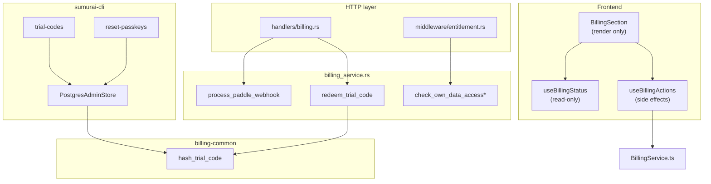

# Billing Architecture Remediation Plan

Status: Complete
Owner: Kody Buss
Last updated: 2026-07-08
Related: [production-paddle-billing-mprd.md](../prd/production-paddle-billing-mprd.md)

## Context

The production Paddle billing MPRD is implemented through Phase 7. This plan addressed architectural debt found during branch review: webhook stub behavior, per-request `BillingService` construction, duplicated trial-code hashing, billing HTTP weight in `main.rs`, dummy Paddle client when billing is disabled, mixed frontend billing orchestration, and misleading CLI store naming.

## Outcome

| Workstream | Status |
| ---------- | ------ |
| 1 — Shared trial-code hashing | Done |
| 2 — Compose `BillingService` on `AppState` | Done |
| 3 — Paddle webhook processing | Done |
| 4 — Extract billing HTTP layer | Done |
| 5 — `NoOpPaddleClient` | Done |
| 6 — Frontend `useBillingActions` | Done |
| 7 — CLI store rename | Done |



Architecture diagrams in [ARCHITECTURE.md](../ARCHITECTURE.md) and [PRODUCTION_BILLING.md](../PRODUCTION_BILLING.md) reflect the billing flow.

## Goals

1. Make Paddle webhook processing the single source of entitlement updates. **Done**
2. Compose billing dependencies once at startup and inject them consistently. **Done**
3. Eliminate duplicated trial-code hashing between backend and CLI. **Done**
4. Reduce `main.rs` billing surface area. **Done**
5. Preserve existing API contracts, error codes, and test coverage. **Done**

## Workstreams

### Workstream 1 — Shared trial-code hashing

**Acceptance criteria:**

- [x] Backend and CLI produce identical hashes for the same key and code.
- [x] Existing `trial_codes_tests` and billing redemption tests pass unchanged in behavior.
- [x] No plaintext trial codes stored or logged.

---

### Workstream 2 — Compose `BillingService` on `AppState`

**Acceptance criteria:**

- [x] No direct `BillingService::new` in handlers or guards.
- [x] All billing mutation handlers use `state.billing_service`.
- [x] Entitlement gate tests still pass without behavior change.
- [x] Disabled billing mode still short-circuits before repository/Paddle calls.

---

### Workstream 3 — Paddle webhook processing in the service layer

**Acceptance criteria:**

- [x] Duplicate webhook event IDs return success without double mutation.
- [x] Out-of-order older events do not downgrade newer entitlement (`last_event_at`).
- [x] Verified webhook is the only path that grants trialing/active entitlement.
- [x] Invalid/missing/stale signatures rejected before JSON business parsing.
- [x] Handler contains no entitlement or repository logic beyond delegation.

---

### Workstream 4 — Extract billing HTTP layer from `main.rs`

**Acceptance criteria:**

- [x] `main.rs` no longer contains billing handler function bodies.
- [x] OpenAPI generation unchanged (same paths/schemas).
- [x] `openapi_tests` and `billing_api_tests` pass.

---

### Workstream 5 — Disabled-mode Paddle client

**Acceptance criteria:**

- [x] No real HTTP client constructed when billing disabled.
- [x] Billing disabled tests prove Paddle client methods are not invoked on mutation paths.

---

### Workstream 6 — Frontend cleanup

**Approach:**

- Added `useBillingActions` with `upgrade`, `redeemTrial`, `addPaymentMethod`, `openPortal`, and pending/error/message state.
- `useBillingStatus` remains read-only.
- `BillingSection` keeps form field state and render logic only.

**Acceptance criteria:**

- [x] Existing Settings and billing tests pass.
- [x] No change to when billing UI is shown/hidden.

**TDD log**

- Green: `bun --cwd=frontend run test -- tests/hooks/useBillingActions.test.tsx tests/views/SettingsPage.test.tsx`.

---

### Workstream 7 — CLI store naming

**Approach:**

- Renamed `PostgresPasskeyResetStore` to `PostgresAdminStore` (implements both `PasskeyResetStore` and `TrialCodeStore`).

**Acceptance criteria:**

- [x] CLI trial-code and reset-passkeys commands still work.
- [x] No behavioral change.

**TDD log**

- Green: `cargo test -p sumurai-cli --locked`.

## Validation commands

```bash
cargo fmt -p sumurai-backend -p entity -p billing-common --check
cargo check --workspace --locked --all-targets
cargo clippy -p sumurai-backend -p entity -p billing-common --locked --all-targets --no-deps -- -D warnings
cargo test -p sumurai-backend --locked
cargo test -p sumurai-cli --locked
bun --cwd=frontend run test
bun --cwd=frontend run typecheck
```

## Definition of done

- [x] Webhook fulfillment grants entitlement without manual intervention.
- [x] Billing dependencies composed once on `AppState`.
- [x] Trial-code hash has a single implementation shared by backend and CLI.
- [x] `main.rs` billing handler bodies extracted to `handlers/billing.rs`.
- [x] Disabled mode uses explicit `NoOpPaddleClient`.
- [x] Frontend billing actions extracted to `useBillingActions`.
- [x] CLI Postgres store renamed to `PostgresAdminStore`.
- [x] All validation commands pass.
- [x] All workstream acceptance criteria checked off.
