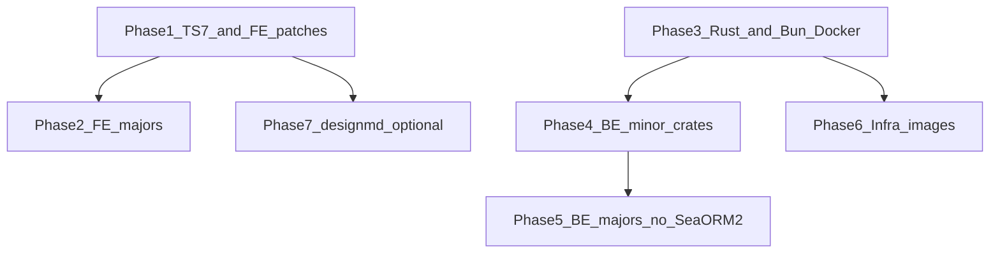

# Package & Toolchain Upgrades — MPRD

## Goal

Bring Sumurai frontend, backend, and CI/CD dependency pins up to current safe targets: TypeScript **7.0.2**, Rust **1.97.1**, routine package/crate bumps, and aligned Docker/CI pins—without SeaORM 2.0 and without a casual `@google/design.md` jump.

Snapshot date for version targets: **2026-07-27**.

## Assumptions & Key Facts

- Versions resolved from `frontend/bun.lock`, `Cargo.lock`, manifests, workflows/Dockerfiles, plus npm/crates.io/Docker Hub tag checks.
- Frontend typecheck: `bun --cwd=frontend run typecheck` (`tsc --noEmit --project tsconfig.ci.json`).
- Frontend uses Biome, not typescript-eslint; TypeScript 7’s missing programmatic API is lower risk here than for ESLint-based stacks. Storybook/Vite/Next compatibility still needs validation.
- TypeScript 7.0 is the native (Go) compiler; package `typescript@7.0.2`. Side-by-side `@typescript/typescript6` exists for tools that still need the TS6 API—Sumurai does not currently need it for Biome.
- Bun **1.3.14** is latest stable; Bun **1.4** is canary (Rust rewrite)—do not move CI/engines to 1.4 yet.
- Rust upgrade rationale: toolchain hygiene + 1.97.1 LLVM miscompile fix + MSRV headroom—not a product feature unlock. Symbol mangling v0 becomes default in 1.97 (usually fine).
- SeaORM stays on **1.1.x** (`1.1.20`). SeaORM **2.0 is out of scope** (minor/patch within 1.x only). `sqlx` follows SeaORM 1.x; ignore crates.io `sqlx` 0.9 until SeaORM moves.
- `@google/design.md` is pre-1.0; Sumurai is on `0.1.1`. Against Sumurai `DESIGN.md`, `0.4.0` DTCG export is identical and lint stays exit 0, but `frontend/scripts/run-designmd.mjs` rewrites `css-tailwind` → `tailwind` (0.1.1 shim). On 0.2+ that yields Tailwind **v3 JSON**, not v4 `@theme` CSS. Do not upgrade design.md until that remap is fixed; prefer exact pin over `^`.
- Token pipeline’s real generator path uses `export --format dtcg` then local `toThemeCss` in `design-token-pipeline.mjs`.
- Validation after each phase: relevant of `bun run precommit`, `frontend:ci`, `backend:ci`, Storybook smoke, compose smoke at `http://localhost:8080`.
- Never read or write `.env` files.

## Version inventory (current → target)

### Toolchain

- TypeScript `6.0.3` (exact) → `**7.0.2**`
- Rust `1.95.0` → `**1.97.1**` (`rust-toolchain.toml`, CI `dtolnay/rust-toolchain`, `backend/Dockerfile` `rust:1.97.1-slim-trixie`)
- Bun `1.3.14` → **stay `1.3.14`**; Docker builder `oven/bun:1-alpine` → `**oven/bun:1.3.14-alpine**`
- Node engines `>=24.10.0` → keep

### Frontend — intentional majors

- `typescript` `6.0.3` → `7.0.2`
- `lucide-react` `0.554.0` → `1.27.0`
- `babel-plugin-react-compiler` beta → `1.0.0`
- `react-plaid-link` `4.1.1` → `5.0.0`
- `undici` `7.26.0` → `8.9.0`
- `@testing-library/jest-dom` `6.9.1` → `7.0.0`
- `@types/node` `25.9.1` → `26.1.2`
- OpenTelemetry web (aligned): exporters/instrumentation `0.208` → `0.221`; `@opentelemetry/sdk-trace-web` / `resources` `2.7.1` → `2.10.0`; `@opentelemetry/auto-instrumentations-web` `0.54` → `0.66`; semantic-conventions `1.41` → `1.43`
- `@google/design.md` — **hold** at `0.1.1` (see Phase 7)

### Frontend — patch/minor

- `next` `16.2.6` → `16.2.12`
- `react` / `react-dom` `19.2.6` → `19.2.8`
- `@biomejs/biome` `2.4.15` → `2.5.5` (update `biome.json` schema)
- Storybook family `10.4.1` → `10.5.5`; `@storybook/addon-mcp` `0.6` → `0.7`
- `vitest` / `@vitest/browser-playwright` `4.1.7` → `4.1.10`
- `@playwright/test` `1.60.0` → `1.62.0`
- `vite` `8.0.14` → `8.1.5`
- `tailwindcss` / `@tailwindcss/postcss` `4.3.0` → `4.3.3`
- `@tanstack/react-query` `5.100.14` → `5.101.4`
- `@tanstack/react-virtual` `3.14.2` → `3.14.8`
- `recharts` `3.8.1` → `3.10.1`
- `framer-motion` `12.40` → `12.42.2`
- `@serwist/next` / `serwist` `9.5.11` → `9.5.12`
- Radix dialog/popover/slider/tooltip → latest 1.x
- `postcss` / `autoprefixer` / `style-dictionary` / `@happy-dom/global-registrator` / `@types/react` patches

### Frontend — already current

- `bun-types` 1.3.14, `embla-carousel-react` 8.6.0, `@heroicons/react` 2.2.0, `serve` 14.2.6, `cross-fetch` 4.1.0

### Backend — out of scope

- `sea-orm` / `sea-orm-migration` **1.1.x only** (no 2.0)
- `webauthn-rs` 0.5.5 (0.6 is `-dev` only)
- `argon2` 0.5.3 (0.6 is RC)
- `ort` `2.0.0-rc.12` (still newest RC)

### Backend — coordinated majors

- `jsonwebtoken` `10.4.0` → `11.0.0`
- `aes-gcm` `0.10.x` → `0.11.0`
- `tower-http` `0.6.11` → `0.7.0`
- OpenTelemetry Rust aligned: `opentelemetry*` `0.31` → `0.32`; `tracing-opentelemetry` `0.32` → `0.33`; `axum-tracing-opentelemetry` `0.33` → `0.38` (verify Axum 0.8)

### Backend — minor/patch

- `tokio` `1.52.3` → `1.53.1`
- `redis` `1.2.1` → `1.4.1`
- `reqwest` `0.13.3` → `0.13.4`
- `hyper` `1.9.0` → `1.11.0`
- `uuid` `1.23.1` → `1.24.0`
- `rust_decimal` `1.42.0` → `1.42.1`
- `prost` `0.14.3` → `0.14.4`
- `serde` / `serde_json` patches
- `mockall` `0.14` → `0.15`
- `ndarray` → `0.17.2`
- `sea-orm` / `sea-orm-migration`: any newer **1.1.x** patch only

### Backend — leave current

- `axum` 0.8.9, `utoipa` 5.5, `governor` / `tower_governor`

### CI/CD & infra images

- CI Rust pin → `1.97.1`; Bun stays `1.3.14`
- CodeQL has no Rust pin today—align when touching that workflow
- Frontend nginx `1.25-alpine` → `**1.29-alpine**`; compose nginx `1.27-alpine` → `**1.29-alpine**` (fix drift)
- Bun builder → `oven/bun:1.3.14-alpine`
- Backend build → `rust:1.97.1-slim-trixie`
- Seq prod `2025.2` → `**2026.1**`
- Postgres `15-alpine` → `**17-alpine**` (major; update `postgresql-client-15` in backend Dockerfile)
- Redis `7-alpine` → `**8-alpine**` (major)
- Pin floating `certbot` / `ngrok` `:latest` when applying infra
- `semantic-pr.yml` runner `ubuntu-latest` → `ubuntu-24.04`
- Root: `@semantic-release/git` `^10` → `^11.0.1`; `conventional-changelog-conventionalcommits` `^9` → `^10.2.1`; semantic-release patch bumps
- Docker build extras to re-check at apply time: `cargo-chef` `0.1.77`, `ONNXRUNTIME_VERSION=1.24.4`
- No Dependabot/Renovate today—optional follow-up after upgrades

## Risks

- TypeScript 7 may expose Storybook/Vite/Next typecheck or plugin issues; validate `typecheck` + Storybook build before merging.
- Frontend majors (`lucide-react` 1.x, `react-plaid-link` 5, OTEL web, jest-dom 7) can change APIs/icons/imports—isolate from the TS7+patch batch.
- `@google/design.md` pre-1.0 + wrapper remap can silently change `css-tailwind` export semantics.
- Backend OTEL / `axum-tracing-opentelemetry` 0.38 and `tower-http` 0.7 may need coordinated code edits.
- Postgres 15→17 and Redis 7→8 are data-plane majors; require compose smoke and migration compatibility checks.
- Rust 1.97 default mangling / louder linker messages may surface new warnings in CI.

## Out of scope

- SeaORM **2.0** upgrade (and sqlx 0.9 chase)
- Bun 1.4 canary
- Casual `@google/design.md` bump without Phase 7
- Adding Dependabot (recommendation only)
- Reading or writing `.env`

## Verification (2026-07-27)

Context7 confirms the core libraries exist (`/websites/typescriptlang`, `/vercel/next.js`, `/websites/rs_sea-orm_1_1_14` / SeaORM 2.x docs). Context7’s version indexes lag slightly (TypeScript catalog tops out at 6.0.2; Next.js indexed through 16.2.9), so exact target pins were also checked on npm, crates.io, and Docker Hub.

- **npm:** all MPRD frontend/root target versions resolve (including `typescript@7.0.2`, `next@16.2.12`, `lucide-react@1.27.0`, `react-plaid-link@5.0.0`, OTEL `0.221` / `2.10`, `@google/design.md@0.1.1` and `0.4.0`).
- **crates.io:** all listed backend targets resolve (including `jsonwebtoken@11.0.0`, `tower-http@0.7.0`, OTEL `0.32` / `axum-tracing-opentelemetry@0.38.0`, `sea-orm@1.1.20`; `sea-orm@2.0.0` exists but remains out of scope).
- **Docker Hub:** `nginx:1.29-alpine`, `postgres:17-alpine`, `redis:8-alpine`, `rust:1.97.1-slim-trixie`, `oven/bun:1.3.14-alpine`, `datalust/seq:2026.1` all exist.

## Next actions

1. Execute phases in order below (student agents: one phase per PR when possible).
2. After each phase, run the listed acceptance checks before starting the next.
3. Re-resolve “latest” versions if this MPRD is executed weeks after the snapshot date.

---

## Phase 1 — TypeScript 7 + frontend patch/minor

**Goal**: Move frontend to TypeScript 7.0.2 and apply the safe patch/minor dependency batch; refresh lockfile and docs that claim TypeScript 6.

### Tasks

- Pin `typescript` to exact `**7.0.2**` in `frontend/package.json`; regenerate `frontend/bun.lock`
- Bump patch/minor packages listed in inventory (Next, React, Biome, Storybook, Vitest, Playwright, Vite, Tailwind, TanStack, Recharts, Framer, Serwist, Radix, postcss/autoprefixer/style-dictionary/happy-dom/`@types/react`)
- Update `frontend/biome.json` schema version to match Biome
- Update `CONTRIBUTING.md` / `AGENTS.md` TypeScript version mentions (6 → 7)
- Run typecheck, Bun tests, design:guard, Storybook-related CI scripts as exercised by `frontend:ci` / precommit

### Acceptance Criteria

- [x] `frontend/package.json` has `typescript` at `7.0.2` (exact)
- [x] `bun --cwd=frontend run typecheck` passes
- [x] `bun --cwd=frontend run test` passes
- [x] `bun --cwd=frontend run design:guard` passes
- [x] Storybook build / iframe smoke path used in CI passes
- [x] CONTRIBUTING/AGENTS no longer claim TypeScript 6 as current

### Notes

- Enabled `experimental.useTypeScriptCli` in `frontend/next.config.mjs` (required for TypeScript 7 + Next.js).
- Kept `@typescript/typescript6` only for `check-ui-imports.mjs` (TS7 stable package has no JS compiler API; design/styling scripts stay as-is).
- Typecheck includes tests via `bun-types` + `bun-types/test-globals` + jest-dom matcher augmentation in `tests/jest.d.ts` (TS7 ~1.7s for app+tests).
- Added CSS custom-property typings for category accent vars.
- Hover-label tests now assert `role="tooltip"` (aria-label-only triggers no longer yield two text nodes).
- Fixed incomplete test fixtures uncovered by including tests in `tsc` (required props such as `demoModeActive`, `provider`, etc.).

### Verification log

- `bun --cwd=frontend run typecheck` — pass (~1.7s, includes tests)
- `bun --cwd=frontend run test` (`bun test --parallel`) — 1424 pass
- `bun --cwd=frontend run design:guard` — pass
- `bun --cwd=frontend run build` — pass
- `bun --cwd=frontend run test:storybook-runtime` — 139 pass

---

## Phase 2 — Frontend intentional majors (except design.md)

**Goal**: Land frontend major upgrades that are approved, excluding `@google/design.md`.

### Tasks

- Upgrade `lucide-react` → `1.27.0`; fix icon import/API breakages
- Upgrade `babel-plugin-react-compiler` → `1.0.0`
- Upgrade `react-plaid-link` → `5.0.0`; fix Plaid link integration call sites
- Upgrade `undici` → `8.x`, `@testing-library/jest-dom` → `7.x`, `@types/node` → `26.x`
- Upgrade OpenTelemetry web packages as an aligned set to inventory targets
- Keep `@google/design.md` at `0.1.1` (exact pin preferred over `^0.1.1`)

### Acceptance Criteria

- [x] Lockfile reflects major targets above; `@google/design.md` still `0.1.1`
- [x] Plaid connect flow typechecks and existing Bun tests for provider/auth paths pass
- [x] No broken lucide icon imports in app/Storybook builds
- [x] OTEL browser instrumentation still initializes without runtime import errors in unit/setup tests
- [x] `bun --cwd=frontend run typecheck` and `bun --cwd=frontend run test` pass

### Notes

- No app code changes required: existing lucide icons, custom Plaid SDK wrapper types, and OTEL `resourceFromAttributes` / ATTR_* usage stayed compatible.
- `@google/design.md` remains exact `0.1.1`.

### Verification log

- `bun --cwd=frontend run typecheck` — pass
- `bun --cwd=frontend run test` — 1424 pass
- `bun --cwd=frontend run design:guard` — pass
- `bun --cwd=frontend run build` — pass
- `bun --cwd=frontend run lint` — pass

---

## Phase 3 — Rust 1.97.1 toolchain + Bun Docker pin

**Goal**: Align local, CI, and Docker Rust to 1.97.1; pin Bun Docker builder to 1.3.14 without changing Bun CI version.

### Tasks

- Set `rust-toolchain.toml` channel to `1.97.1`
- Update `.github/workflows/ci.yml` `dtolnay/rust-toolchain` to `1.97.1`
- Update `backend/Dockerfile` base to `rust:1.97.1-slim-trixie`
- Pin `frontend/Dockerfile` builder to `oven/bun:1.3.14-alpine` (leave CI `bun-version: 1.3.14`)
- Update CONTRIBUTING/AGENTS Rust version mentions (1.95 → 1.97.1)
- Optionally note CodeQL missing Rust pin for a later CI hygiene PR

### Acceptance Criteria

- [x] `rustc --version` via toolchain file resolves to 1.97.1
- [x] `cargo check --workspace --locked --all-targets` and `cargo clippy --workspace --locked` succeed
- [x] `cargo test --workspace --locked` (or `bun run backend:ci`) passes
- [x] Dockerfile and CI pins match 1.97.1; Bun Docker tag is `1.3.14-alpine`

### Notes

- Fixed new Clippy `useless_borrows_in_formatting` in `repository_service_tests.rs` under Rust 1.97.
- CodeQL workflow still has no explicit Rust toolchain pin (follow-up CI hygiene).

### Verification log

- `rustc --version` — 1.97.1
- `bun run backend:ci` — pass

---

## Phase 4 — Backend minor/patch crates

**Goal**: Apply non-breaking backend crate bumps within current major lines; SeaORM remains 1.1.x.

### Tasks

- Bump inventory minor/patch crates in workspace Cargo.toml files (`tokio`, `redis`, `reqwest`, `hyper`, `uuid`, `rust_decimal`, `prost`, serde family, `mockall`, `ndarray`, and any newer `sea-orm` **1.1.x** only)
- Run `cargo update` for those packages only as needed; commit `Cargo.lock`
- Do **not** bump sea-orm to 2.x, jsonwebtoken 11, aes-gcm 0.11, tower-http 0.7, or OTEL majors in this phase

### Acceptance Criteria

- [x] `Cargo.lock` shows minor/patch targets; `sea-orm` still `1.1.x`
- [x] `bun run backend:ci` passes
- [x] No SeaORM 2.0 or sqlx 0.9 forced upgrade in the lockfile

### Notes

- Locked: tokio 1.53.1, redis 1.4.1, reqwest 0.13.4, hyper 1.11.0, uuid 1.24.0, rust_decimal 1.42.1, prost 0.14.4, mockall 0.15.0, serde 1.0.229, serde_json 1.0.151; sea-orm/sqlx unchanged at 1.1.20 / 0.8.6.

### Verification log

- `bun run backend:ci` — pass

---

## Phase 5 — Backend coordinated majors (no SeaORM 2)

**Goal**: Upgrade jwt, crypto, tower-http, and Rust OpenTelemetry stack together with required code fixes.

### Tasks

- Upgrade `jsonwebtoken` → `11.0.0` and fix API breakages
- Upgrade `aes-gcm` → `0.11.0` and fix API breakages
- Upgrade `tower-http` → `0.7.0` and fix middleware usage
- Upgrade OpenTelemetry crates as an aligned set (`opentelemetry*` 0.32, `tracing-opentelemetry` 0.33, `axum-tracing-opentelemetry` 0.38); verify Axum 0.8 compatibility
- Leave `sea-orm` on 1.1.x

### Acceptance Criteria

- [x] Manifests/lockfile reflect Phase 5 majors; sea-orm still 1.1.x
- [x] Auth/JWT, encryption, HTTP middleware, and tracing paths compile
- [x] `bun run backend:ci` passes
- [x] Existing auth/provider/cache-focused backend tests still pass

### Notes

- Only code change: `ConsoleSpanExporter::shutdown` now takes `&self` (OTEL SDK 0.32).
- jwt 11 / aes-gcm 0.11 / tower-http 0.7 / axum-tracing-opentelemetry 0.38 needed no API call-site edits.

### Verification log

- `bun run backend:ci` — pass

---

## Phase 6 — Infra images & release tooling

**Goal**: Align compose/Docker nginx, Seq, Postgres, Redis, runner images, and root semantic-release deps.

### Tasks

- Frontend runtime nginx → `nginx:1.29-alpine`; all compose proxy nginx → `nginx:1.29-alpine`
- Seq (prod) → `datalust/seq:2026.1`
- Postgres → `postgres:17-alpine`; backend Dockerfile `postgresql-client` major aligned to 17
- Redis → `redis:8-alpine`
- Pin `certbot` / `ngrok` away from floating `:latest` where practical
- Align `semantic-pr.yml` to `ubuntu-24.04`
- Bump root `@semantic-release/git`, `conventional-changelog-conventionalcommits`, and semantic-release patch deps; refresh root `bun.lock`
- Re-check `cargo-chef` and `ONNXRUNTIME_VERSION` pins while editing backend Dockerfile

### Acceptance Criteria

- [ ] Compose and Dockerfiles use the target image tags above; nginx versions no longer drift (1.25 vs 1.27)
- [ ] Dev/prod compose stack comes up; app reachable at `http://localhost:8080`
- [ ] Backend image build still succeeds with updated postgres client / rust base
- [ ] Root release tooling installs cleanly with updated lockfile

---

## Phase 7 — `@google/design.md` evaluation (optional hold)

**Goal**: Only if explicitly scheduled—safely evaluate/upgrade `@google/design.md` after fixing the Sumurai wrapper.

### Tasks

- Remove or invert the `css-tailwind` → `tailwind` rewrite in `frontend/scripts/run-designmd.mjs` so `css-tailwind` means Tailwind v4 `@theme` CSS on 0.2+
- Exact-pin `@google/design.md` (no caret) when bumping; candidate latest at snapshot: `0.4.0`
- Run `design:lint`, `design:guard`, and drift checks; confirm DTCG + generated artifacts remain correct
- Document any new lint rules (`unknown-key`, `omitted`, typography field warnings) that affect `DESIGN.md`

### Acceptance Criteria

- [ ] Wrapper no longer maps `css-tailwind` to JSON `tailwind` on modern design.md
- [ ] `bun --cwd=frontend run design:guard` passes on the chosen version
- [ ] Generated `tokens.dtcg.json` / `theme.css` / `tokens.ts` match expectations (no silent format swap)
- [ ] Package version is exact-pinned in `frontend/package.json`

---

## Suggested dependency graph

Phases 1–2 (frontend) and 3–5 (backend) may proceed in parallel after kickoff; Phase 6 should follow Phase 3 for Rust image alignment. Phase 7 stays optional and blocked on wrapper fix.