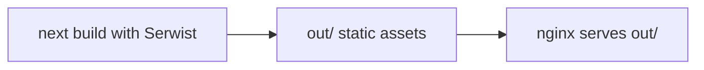

# PWA support for Sumurai (Next.js 16 + Serwist)

**Overview:** Add installable PWA behavior to the Sumurai Next.js 16 frontend using the App Router `manifest` convention and Serwist for build-time service worker precaching, while respecting static export (`output: 'export'`) and nginx `out/` deployment.

**Next actions (checklist):**

- [x] Phase 1: manifest.ts, viewport, appleWebApp, icons; meet acceptance criteria
- [ ] Phase 2: @serwist/next, next.config, src/app/sw.ts API-safe precache; meet acceptance criteria
- [ ] Phase 3: client SW registration when NODE_ENV=production (Docker Compose + prod); meet acceptance criteria
- [ ] Phase 4: out/ artifacts, Lighthouse, SW behavior checks; meet acceptance criteria
- [ ] Phase 5: Jest coverage for new helpers; meet acceptance criteria

---

## Context7-confirmed baseline (2026)

- **Next.js (Context7: `/vercel/next.js/v16.2.2`)** — Official guide [Progressive Web Apps](https://github.com/vercel/next.js/blob/v16.2.2/docs/01-app/02-guides/progressive-web-apps.mdx) documents `app/manifest.ts` returning `MetadataRoute.Manifest`; Next injects the manifest link automatically. The same guide shows registering a compiled worker at `/sw.js` via `navigator.serviceWorker.register('/sw.js', { scope: '/', updateViaCache: 'none' })`. It also documents `appleWebApp` / startup images via [generate-metadata](https://github.com/vercel/next.js/blob/v16.2.2/docs/01-app/03-api-reference/04-functions/generate-metadata.mdx) and optional `icon.tsx` / `apple-icon` conventions ([app-icons](https://github.com/vercel/next.js/blob/v16.2.2/docs/01-app/03-api-reference/03-file-conventions/01-metadata/app-icons.mdx)).
- **Serwist (Context7: `/websites/serwist_pages_dev`)** — [Getting started](https://serwist.pages.dev/docs/next/getting-started) documents `withSerwistInit`, `swSrc`, `swDest` (commonly `public/sw.js`), and optional `additionalPrecacheEntries`. Docs also show optional **runtime caching** helpers (e.g. patterns like `defaultCache`); this plan treats **build precache as primary** and keeps runtime rules minimal so `/api/` is never cached (see below). [Configurator mode](https://serwist.pages.dev/docs/next/config) describes running the worker build **after** Next prerendering, which fits static export.

Official docs confirm manifest + Serwist wiring; this repo still needs **path fixes (`src/app`)**, **export output verification**, and **API-safe SW rules** (below).

## Caching strategy alignment

The app already owns **data caching** (client-side strategy for API-derived state). The PWA layer adds **static asset precaching** (JS/CSS/HTML/fonts from the export) so repeat visits and reloads can reuse the **shell** from cache. That is **not** full offline mode: **`/api/` remains network-dependent** unless you add separate offline data handling. The SW must not become a second cache for API responses.

- **Service worker must not cache `/api/`** (or other backend-facing fetch URLs). Use **network-only / no interception** for those routes so Serwist never competes with your existing data cache or serves stale authenticated JSON.
- **OpenTelemetry / OTLP** and other non-HTML beacons should also bypass SW caching.
- Prefer **precache entries** from the build; add **runtime caching** only with routes audited against Serwist’s matchers so **`/api/`** and authenticated JSON are never cached. Treat upstream `defaultCache` examples as documentation, not a drop-in for this app until confirmed safe.

This keeps responsibility split: **Serwist = static export artifacts**, **existing app logic = data**.

## Decisions

**Locked defaults**

- **Icons**: Use **reasonable implementation defaults** (e.g. generated `icon` / `apple-icon` routes and/or small PNG set in `public/`) that satisfy manifest sizes and Lighthouse maskable expectations without a separate design round-trip.
- **Manifest `theme_color` / `background_color`**: The **in-app theme is user-selected**; the **manifest cannot follow that at runtime** unless you add a dynamic manifest (out of scope here). Use **fixed baseline values** aligned with the **default / dark-first** presentation from [`DESIGN.md`](../DESIGN.md) so install splash, browser chrome hints, and splash screens look coherent **before** client hydration; they do not replace per-session UI theme.
- **Service worker registration**: Register when the client bundle is a **production build** (`NODE_ENV === 'production'`). That matches **default Docker Compose** (nginx serves the production-built `out/` bundle) and **production**, and avoids **`next dev`** quirks unless you revisit later.

**Still optional**

- **Dedicated offline page**: Yes/no on a real **`/offline/`** route; if no, do not add Serwist `additionalPrecacheEntries` for URLs that do not exist.

**Usually no meeting — resolve during implementation**

- **`next.config.js` (CJS) vs `next.config.mjs` (ESM)** — Pick whichever Serwist + Next 16 accept with least churn; preserve `output`, `trailingSlash`, `reactCompiler`.
- **`runtimeCaching` shape** — Driven by installed Serwist docs and the hard rule that **`/api/`** and OTLP paths are not cached.

Everything else in the prerequisites section is **verification** (manifest filename in `out/`, precache contents), not a policy choice.

## Implementation prerequisites (lookups and decisions)

Facts already grounded in the repo:

- **Paths**: App Router lives under [`frontend/src/app`](../frontend/src/app); Serwist `swSrc` must be **`src/app/sw.ts`**, not `app/sw.ts`.
- **Export**: [`frontend/next.config.js`](../frontend/next.config.js) has `output: 'export'` and **`trailingSlash: true`** — manifest `start_url` / `scope` must match how nginx serves the SPA (`try_files` + trailing-slash URLs).
- **Icons today**: [`frontend/public`](../frontend/public) only has **`bmc-new-btn-logo.svg`** and **`tbf-logo.svg`** — implement **reasonable defaults** for manifest icons (generated routes and/or PNGs); Lighthouse expects suitable sizes and often **maskable**.
- **Manifest colors vs UI theme**: [`DESIGN.md`](../DESIGN.md) supplies brand tokens; **`manifest.ts` uses fixed `theme_color` / `background_color`** for install/OS chrome tied to a **default dark-first** baseline. **User-selected in-app theme stays independent** and does not require updating the manifest each session.
- **API base**: [`frontend/src/services/ApiClient.ts`](../frontend/src/services/ApiClient.ts) uses `NEXT_PUBLIC_API_BASE` or **`/api`** in non-dev; SW must **never** cache **`/api/**`** on the **deployed origin** (same-origin as the app behind nginx).
- **Telemetry URLs**: [`frontend/src/observability/telemetry.ts`](../frontend/src/observability/telemetry.ts) exports OTLP via **`/api/v1/public/telemetry`** (and ignore patterns include `/api/v1/public|private/telemetry`) — SW runtime rules must **not** cache these paths.
- **Config module format**: [`frontend/next.config.js`](../frontend/next.config.js) is **CommonJS** (`module.exports`). Serwist docs often show **ESM** (`import` / `next.config.mjs`). Before implementing Phase 2, confirm **`withSerwistInit`** works with CJS or plan a **`next.config.mjs`** migration that preserves existing options (`reactCompiler`, `output`, `trailingSlash`).

Decisions or verification during implementation (no guessing in advance):

- **Exact manifest URL in `out/`** — Record the emitted filename after first successful build (e.g. `manifest.webmanifest` vs hash); Phase 1 acceptance should cite the actual path.
- **Serwist build mode** — Use **configurator** / post-prerender integration per current `@serwist/next` docs so precache sees full static export output; confirm **`npm --prefix frontend run build`** runs the Serwist step without Turbopack-only assumptions (production build path is canonical).
- **`defaultCache` or custom `runtimeCaching`** — Read installed Serwist’s matcher behavior; accept Phase 2 only if **`/api/`** and telemetry paths are provably non-cached (code review of `sw.ts` + spot-check generated `sw.js`).
- **Service worker registration** — Register only when **`process.env.NODE_ENV === 'production'`** (covers **Docker Compose** static bundle and **production**; excludes **`next dev`** unless policy changes).
- **Optional offline shell page** — Only if product wants a dedicated **`/offline/`** route; otherwise omit `additionalPrecacheEntries` for fictional URLs.

## Build and deployment: static export

**This is not a constraint on your data-caching design.** It only describes **how the frontend is produced and served**: a prebuilt `out/` tree behind nginx, with **no Node `next start`** in production.

[`frontend/next.config.js`](../frontend/next.config.js) sets `output: 'export'`. The Docker image copies the build output from the image’s frontend `out/` into nginx’s docroot ([`frontend/Dockerfile`](../frontend/Dockerfile)).

**Why the plan still calls this out:** PWA work must target **`out/` + static files** (manifest, `sw.js`, icons), and Serwist must run correctly in **`next build`**, not assume a long-lived Next server.

Implications (Context7: Next static exports doc for `/vercel/next.js/v16.2.2`):

- **No runtime Next server** — `next start` is not used; assets must exist under `out/` after `next build`.
- **Next.js server features are limited** — e.g. **Server Actions** and other server-only App Router features listed in the static export guide are unavailable or restricted. This does **not** break **browser `fetch` to the Rust API** or **HTTP cookies** on those requests (your app already uses `credentials: 'include'` against `/api`). The Next docs’ **Web Push** tutorial leans on Server Actions; an export-friendly push flow would use the **Rust backend** plus client-side subscription handling, and is out of scope for the first PWA iteration.
- **Service worker output** — Serwist should emit `public/sw.js` during `next build`; static export includes `public/` in `out/`. Confirm `out/sw.js` (or equivalent) exists after build.

## Implementation (phased)

### Phase 1 — Manifest, viewport, and icons

**Scope**

- Add [`frontend/src/app/manifest.ts`](../frontend/src/app/manifest.ts) (`src/app`, not root `app/`): `name`, `short_name`, `description`, `display: 'standalone'`, `start_url` / `scope` aligned with nginx serving the SPA from `/` and [`next.config.js`](../frontend/next.config.js) `trailingSlash: true`.
- `theme_color` / `background_color`: fixed values from **default dark-first** intent in [`DESIGN.md`](../DESIGN.md) / design-system skill — **not** wired to per-user theme preference (manifest is static at build time for this iteration).
- Icons: **reasonable defaults** — `icon.tsx` / `apple-icon.tsx` and/or PNGs in [`frontend/public`](../frontend/public) so manifest lists 192 / 512 (and maskable if audits require).
- Extend [`frontend/src/app/layout.tsx`](../frontend/src/app/layout.tsx): `export const viewport` (mobile-friendly PWA defaults), `metadata.appleWebApp` as needed.

**Acceptance criteria**

- `npm --prefix frontend run build` succeeds.
- Built `out/` contains a valid web manifest (Next-emitted path such as `manifest.webmanifest` or equivalent) with correct `name` / `short_name` / `icons` / `display`.
- Document HTML references the manifest and icons (view page source or DevTools Application tab).
- No regression: existing app shell still loads; `typecheck` and `design:guard` (if icons touch tokens) pass per repo norms.

### Phase 2 — Serwist build and service worker source

**Scope**

- Add **`@serwist/next`** and **`serwist`** per package README; upgrade/install per repo conventions.
- Wrap [`frontend/next.config.js`](../frontend/next.config.js) with `withSerwistInit`: `swSrc`: `src/app/sw.ts`, `swDest`: `public/sw.js` (and `swUrl` if dest changes).
- Implement [`frontend/src/app/sw.ts`](../frontend/src/app/sw.ts): **precache** via `self.__SW_MANIFEST`; **runtime caching** only if explicitly narrowed—**no caching of `/api/`** or authenticated JSON; OTLP/beacon URLs not cached. Optional `additionalPrecacheEntries` only if a real `/offline/` (or similar) page exists.
- Confirm Serwist integration matches Next 16 static export (configurator / post-prerender behavior per Serwist docs).

**Acceptance criteria**

- `npm --prefix frontend run build` completes; `frontend/out/sw.js` exists (or `public/sw.js` present and copied into `out/`).
- Precache manifest in `sw.js` includes expected static assets from the export (spot-check: main JS/CSS chunks).
- Service worker source and generated `sw.js` contain **no route** that caches `**/api/**` as stale-while-revalidate or cache-first without explicit team approval (network-only or bypass for API is the default bar).
- `npm --prefix frontend run typecheck` passes.

### Phase 3 — Client registration

**Scope**

- Add a **`'use client'`** component that registers `navigator.serviceWorker.register('/sw.js', { scope: '/', updateViaCache: 'none' })` in `useEffect` **only when `process.env.NODE_ENV === 'production'`** (Docker Compose nginx bundle + production; not `next dev`).
- Mount it from [`frontend/src/app/layout.tsx`](../frontend/src/app/layout.tsx) without converting the root layout to a client component.

**Acceptance criteria**

- In a **production build**, DevTools → Application → Service Workers shows an **activated** worker for `/sw.js` with scope `/` when served from **HTTPS or `localhost`** (typical Compose on `http://localhost:8080` qualifies as a secure context for service workers in Chromium).
- Registration errors are not silently swallowed in a way that breaks the app (acceptable: no SW on unsupported browsers).
- With `next dev`, no registration attempt (or no activated worker); with **default Docker Compose** (production-built static bundle) or **production**, worker activates when the origin allows service workers (HTTPS or localhost).

### Phase 4 — Verification and audits

**Scope**

- Run Lighthouse **PWA** (or equivalent) against the **same surface you ship**: static `out/` via `npx serve`, Docker/nginx, or staging TLS URL.
- Manually confirm: install / Add to Home Screen prompt or criteria (Chromium); iOS install path if `appleWebApp` is set.
- Spot-check after deploy pattern: open app, trigger authenticated `/api/` flows—responses must not be served from Cache Storage as generic cached JSON (DevTools → Network + Application → Cache Storage).

**Acceptance criteria**

- Lighthouse PWA category: **no blocking failures** for manifest, icons, HTTPS, and service worker (exact score threshold optional; goal is installability and no critical gaps).
- Authenticated API calls behave identically to pre-PWA for the same backend (no stale data attributable to SW).
- Documented note if dev (`next dev --turbo`) does not register SW—**`next build` output remains canonical**.

### Phase 5 — Automated tests

**Scope**

- Add Jest tests under [`frontend/tests/`](../frontend/tests/) for **pure helpers** introduced in Phases 1–3 (e.g. manifest field builders, registration guard predicates, env gating). Follow [`.agents/skills/sumurai-testing-policy/SKILL.md`](../.agents/skills/sumurai-testing-policy/SKILL.md). No inline tests in source files.

**Acceptance criteria**

- `npm --prefix frontend test` passes.
- New tests fail if API-caching rules or registration guard logic regresses in an obvious way (where such logic is factored out for testability).

## Explicit non-goals for first iteration

- **Web Push end-to-end** — needs VAPID, subscription storage, and sending path (feasible via **Rust**, not the Next Server Actions example in the PWA guide). Defer unless product prioritizes it.
- **Replacing static export** — not required for installability + static precache if `sw.js` lands in `out/` and nginx serves it.

### Phase 1 TDD log

- Tests: `frontend/tests/pwa/manifestConstants.test.ts` (`npm --prefix frontend test -- --testPathPatterns=pwa`).
- Static export requires `export const dynamic = 'force-static'` on `manifest.ts`, `icon.tsx`, and `apple-icon.tsx`.
- Built manifest path: `frontend/out/manifest.webmanifest`. Icon precache URLs in manifest: `/icon/192`, `/icon/512` (files under `out/icon/192` and `out/icon/512`).
- Theme and background colors load from `frontend/src/ui/generated/tokens` via `manifestConstants` / ImageResponse icons so `design:guard` passes without raw hex.

## Risk register (short)

| Risk | Mitigation |
|------|------------|
| Dev server vs `next build` SW output | Treat `npm run build` and `out/` as the source of truth; dev may not mirror SW generation. |
| SW caches `/api/` and fights app data cache | Force network-only (or no route) for `/api/`; keep SW scope limited to static precache + safe runtime rules. |
| `trailingSlash: true` vs manifest `start_url` | Ensure `start_url` matches how users land (`/` vs `/index.html` semantics with nginx `try_files`). |
| Icon / maskable requirements | Include `purpose: 'any maskable'` icons if Lighthouse flags missing maskable icons. |
