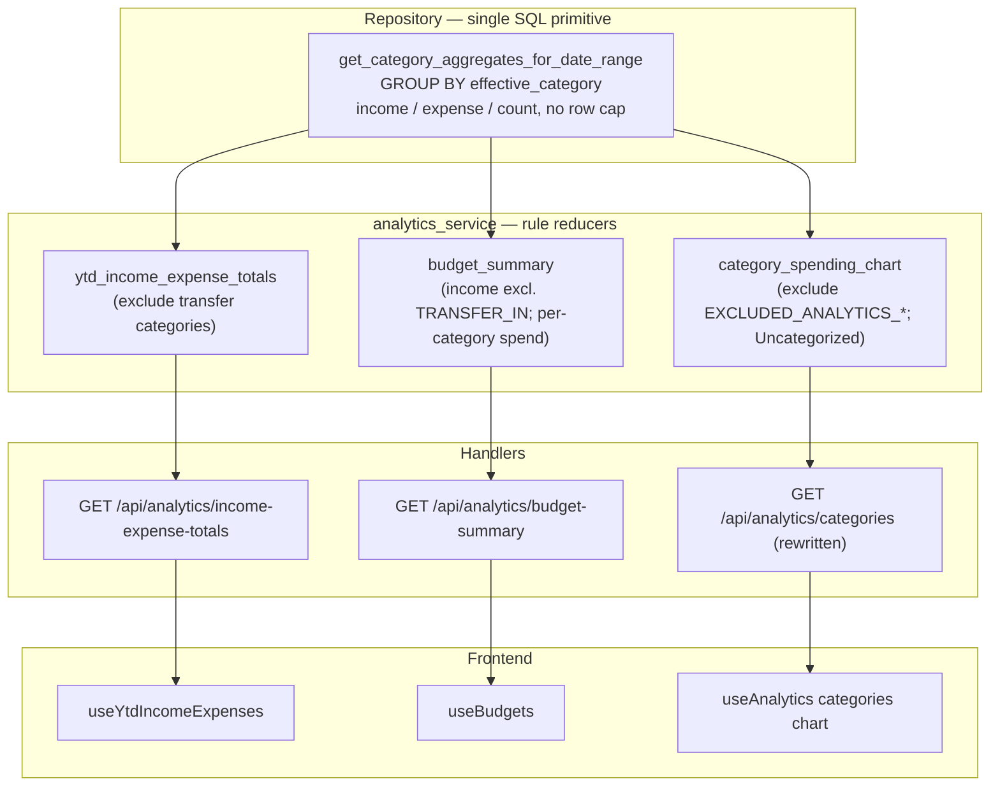

# Transaction Aggregate & Search Regressions — MPRD

## Goal

Fix two regressions introduced by PR #164 (`fde92f75`, virtualized lists + keyset pagination):

1. **Aggregate truncation (P1):** Dashboard YTD and budget totals silently under-count because aggregate callers still bulk-fetch via `TransactionService.getTransactions()` → `getAllTransactions`, which sends ignored `page`/`page_size` params while the backend returns only the first cursor page (~40 rows).
2. **Search regression (P2):** Transaction `search` now matches `merchant_name` only; pre-PR it OR'd `category_primary`, `category_detailed`, and `accounts.name`, breaking list search and both insights endpoints.

**Chosen fix for P1:** Server-side SQL aggregates over the full filtered date range, decoupled from list paging. Do **not** restore backend `page`/`page_size` compatibility on `GET /api/transactions`.

---

## Context

### P1 — Aggregate callers silently truncated

| Caller | File | Current fetch path |
|--------|------|-------------------|
| `useYtdIncomeExpenses` | `frontend/src/features/analytics/hooks/useYtdIncomeExpenses.ts` | `TransactionService.getTransactions({ startDate, endDate, accountIds })` → `getAllTransactions` |
| `useBudgets` | `frontend/src/features/budgets/hooks/useBudgets.ts` | Same, with month `range.start` / `range.end` |

`getAllTransactions` (`frontend/src/services/TransactionService.ts`) loops with `page=1,2,…` and `page_size=200` (`DEFAULT_FETCH_PAGE_SIZE`), building URLs like `/transactions?start_date=...&end_date=...&page=1&page_size=200`.

The backend handler `get_authenticated_transactions` (`backend/src/main.rs`, ~L1178) uses cursor/limit only (`limit = limit.unwrap_or(40).clamp(1, 100)`). `TransactionsQuery` (`backend/src/models/transaction.rs`) drops unknown query keys (`page`, `page_size`) via `IgnoredAny`. Response shape is `CursorTransactionsResponse` — no `total`, `page`, or `page_size`.

`toPaginatedTransactionsResponse` falls back when `total` is missing: `total = transactions.length` (e.g. 40). The loop exits after one page because `paginated.transactions.length < paginated.page_size`.

**User-visible symptoms:**

- `useBudgets` `computedBudgets.spent` only sees first ~40 month transactions.
- `useYtdIncomeExpenses` on dashboard only aggregates first ~40 YTD transactions.

**Not broken:** Transaction list UI (`useInfiniteTransactions` → `getTransactionsPage` with `cursor` + `limit: TRANSACTION_PAGE_LIMIT` = 40).

### P2 — Search narrowed to merchant only

`apply_transaction_filters` (`backend/src/services/repository_service.rs`, ~L970) currently filters search on `LOWER(COALESCE(merchant_name, ''))` only. Pre-PR #164 (`fde92f75^`) it was a 4-way `Condition::any()` across merchant, `category_primary` (raw stored column), `category_detailed`, and `accounts.name`.

`insights_filtered_select` (~L1024) wraps `apply_transaction_filters`, so the fix propagates to insights without touching those code paths.

**Affected endpoints:**

- `GET /api/transactions` (keyset list — `get_transactions_keyset`)
- `GET /api/transactions/insights`
- `GET /api/transactions/contextual-insights`

**Docs still claim multi-field search:** OpenAPI (`docs/OPENAPI.json`), utoipa on handlers, `docs/virtualized-transaction-lists-prd.md` Phase 1 AC ("search behavior unchanged").

**User-visible symptoms:**

- Searching an account name returns nothing unless merchant also matches.
- Searching a category code (`TRANSPORTATION`) or detailed label (`Fuel`) returns nothing unless merchant matches.
- Insights cards driven by `search` are equally narrowed.

### Adjacent (pre-existing, not a #164 regression) — `/analytics/categories` truncation

`get_authenticated_category_spending` (`backend/src/main.rs`, ~L2744) loads via `analytics_service.load_spending_transactions` → `get_spending_transactions_by_date_range_for_user` (`repository_service.rs`, ~L2386) which applies `.limit(1000)` (~L2420), then groups in memory (`group_by_category_with_date_range`). Busy months (>1000 spending rows) truncate. Fixed in **Phase 4** as a separable change.

---

## Architecture — one primitive, rules as composition



**The primitive.** Raw SQL (same pattern as `monthly_cash_flow_statement`, ~L850), grouped by `sql_effective_category_expr()` = `COALESCE(o.category_name, t.category_primary)`:

```sql
SELECT
  COALESCE(o.category_name, t.category_primary) AS category,
  SUM(CASE WHEN t.amount > 0 THEN t.amount ELSE 0 END)  AS income,
  SUM(CASE WHEN t.amount < 0 THEN -t.amount ELSE 0 END) AS expense,
  COUNT(*) AS count
FROM transactions t
LEFT JOIN transaction_category_overrides o ON ...
WHERE t.user_id = $user
  AND t.date >= $start AND t.date <= $end
  [AND t.account_id = ANY($accounts)]
GROUP BY 1
```

No transfer/exclusion filtering happens in SQL — the grid returns every effective category. Each consumer applies its own rule over the grid in Rust, so divergent rules (which differ in *both* the excluded set *and* the matching style) stay explicit and isolated:

| Consumer | income | expense / spend |
|----------|--------|-----------------|
| YTD (`ytd_income_expense_totals`) | Σ `income` where `!is_transfer_category(cat)` | Σ `expense` where `!is_transfer_category(cat)` |
| Budget (`budget_summary`) | Σ `income` where `cat != "TRANSFER_IN"` (exact) | per-category `expense` (all rows) |
| Categories chart (`category_spending_chart`) | — | per-category `expense` where `cat ∉ EXCLUDED_ANALYTICS_CATEGORY_PRIMARIES`; empty `cat` → `"Uncategorized"` |

This reproduces the existing rules exactly (verified against `computeYtdIncomeExpenses`, `BudgetCalculator`, and `group_transactions_by_category` + `spending_category_filter`).

---

## Domain rules the backend must encode (single source of truth)

These were previously implemented in TS calculators; after this work the **backend owns them** and the TS copies are deleted. Parity is proven by Rust reducer tests ported from the existing TS test cases.

### YTD — `ytd_income_expense_totals` (was `computeYtdIncomeExpenses`)

- Range: `YYYY-01-01` through today (current year) or `YYYY-12-31`.
- Exclude effective category `TRANSFER_IN` / `TRANSFER_OUT` (and `TRANSFER_*_` prefixes — `is_transfer_category`).
- `income` = Σ positive amounts; `expenses` = Σ |negative amounts|.
- Does **not** apply `EXCLUDED_ANALYTICS_CATEGORY_PRIMARIES`.

### Budget — `budget_summary` (was `BudgetCalculator.calculateSpent` + `calculateIncome`)

- `income`: positive amounts only, exclude effective category exactly `TRANSFER_IN` (not `TRANSFER_OUT` — **differs from YTD**; a positive `TRANSFER_OUT` still counts).
- `category_spending`: per effective category, Σ |negative amounts|. Friendly-name matching to budget rows (`formatCategoryName`, case-insensitive) stays **frontend-side** in `useBudgets` — the backend returns the raw effective-category grid.

### Categories chart — `category_spending_chart` (was `group_transactions_by_category`)

- Negative amounts only, grouped by effective category, **no row limit**.
- Exclude `EXCLUDED_ANALYTICS_CATEGORY_PRIMARIES` = `[INCOME, LOAN_PAYMENTS, TRANSFER_IN, TRANSFER_OUT, BANK_FEES]`.
- Empty effective category → `"Uncategorized"`.

> Note: `t.category_primary` as serialized to the API is already the effective category (`column_as(effective_category_expr(), "category_primary")`), so the frontend calculators it replaces were also operating on effective category — the SQL grouping is behavior-preserving.

---

## Phase 1 — Shared aggregate primitive + rule reducers (backend)

### Goal

Add the single per-category aggregate query and the three rule reducers that compose it. This is the keystone; Phases 2–4 are thin wiring on top.

### Tasks

- Add repository method `get_category_aggregates_for_date_range(user_id, start, end, account_ids) -> Vec<CategoryAggregate>` in `backend/src/services/repository_service.rs`
  - Raw SQL grouped by `sql_effective_category_expr()`; `income`/`expense`/`count` per category; **no row cap**
  - Empty `account_ids` slice → return empty (match existing `matches!(account_ids, Some([]))` guards)
  - Add `CategoryAggregate { category: String, income: Decimal, expense: Decimal, count: i64 }` (model)
- Add `DatabaseRepository` trait method + mock/stub updates in `backend/src/tests/`
- Add reducers in `backend/src/services/analytics_service.rs` over `Vec<CategoryAggregate>`:
  - `ytd_income_expense_totals(grid) -> IncomeExpenseTotals { income, expenses }`
  - `budget_summary(grid) -> BudgetSummary { income, category_spending: Vec<CategorySpending> }`
  - `category_spending_chart(grid) -> Vec<CategorySpending>`
- Tests:
  - Repository integration test: fixture with mixed signs, transfers, category overrides, and **>1000 rows in range**; assert the grid sums/counts include all rows
  - Reducer unit tests porting the cases from `frontend/tests/domain/YtdTotalsCalculator.test.ts` and the budget calculator tests (transfer handling, sign rules, exclusion-set differences)

### Acceptance Criteria

- [x] Primitive returns per-effective-category `income`/`expense`/`count` over the full range with no row cap
- [x] `account_ids` filter scopes results; empty selection returns empty
- [x] `ytd_income_expense_totals` excludes transfers (both directions), does not apply `EXCLUDED_ANALYTICS_CATEGORY_PRIMARIES`
- [x] `budget_summary.income` excludes only `TRANSFER_IN`; `category_spending` is per-category negative-sum
- [x] `category_spending_chart` excludes `EXCLUDED_ANALYTICS_CATEGORY_PRIMARIES`, maps empty category to `"Uncategorized"`
- [x] `cargo test -p sumurai-backend --locked` passes (including the >1000-row case)

### TDD Log

- Red: added repository and analytics-service specs for aggregate totals, category chart rules, and the >1000-row integration case.
- Green: added `CategoryAggregate`, `IncomeExpenseTotals`, and `BudgetSummary`, then wired the repository SQL aggregate and analytics reducers.
- Refactor: kept the reducers boundary-only, sorted budget summary output for stable assertions, and left chart ordering driven by the reducer input.
- Verification: `cargo test -p sumurai-backend --locked analytics_service_tests -- --nocapture`, `cargo test -p sumurai-backend --locked repository_service_tests -- --nocapture`, `cargo test -p sumurai-backend --locked`.

---

## Phase 2 — YTD endpoint + frontend; delete YTD calculator

### Goal

Expose `ytd_income_expense_totals` and move `useYtdIncomeExpenses` onto it; remove the now-dead TS calculator.

### Tasks

- Add response model `IncomeExpenseTotals { income, expenses }` in `backend/src/models/analytics.rs`
- Add handler `GET /api/analytics/income-expense-totals` (`backend/src/main.rs`), params `start_date`/`end_date`/`account_ids` (same `DateRangeQuery` / `AuthorizedQuery` pattern as other analytics endpoints); utoipa doc; register route
- Regenerate OpenAPI (`backend/openapi/`, `docs/OPENAPI.json`)
- Add `AnalyticsService.getIncomeExpenseTotals(startDate?, endDate?, accountIds?)` (`frontend/src/services/AnalyticsService.ts`); mirror types in `frontend/src/types/api.ts`
- Update `useYtdIncomeExpenses.ts`: call the endpoint, map to `{ incomeYtd, expensesYtd }`; keep query-key structure and empty-account guard
- **Delete** `frontend/src/domain/YtdTotalsCalculator.ts` (`computeYtdIncomeExpenses`, `isTransferCategory`) and `frontend/tests/domain/YtdTotalsCalculator.test.ts` — sole consumers are the migrated hook and its own test (verified)
- Update/replace hook test: mock `getIncomeExpenseTotals`; assert hook surfaces server values

### Acceptance Criteria

- [ ] Dashboard YTD panel loads without a bulk `GET /transactions`
- [ ] `incomeYtd` / `expensesYtd` reflect the server aggregate over the full YTD range
- [ ] `YtdTotalsCalculator.ts` and its test are removed; no remaining imports
- [ ] `bun --cwd=frontend test` and `bun --cwd=frontend run typecheck` pass

---

## Phase 3 — Budget summary endpoint + frontend; delete budget aggregation calculators

### Goal

Expose `budget_summary` and move `useBudgets` + budget insights onto it; remove the dead transaction-scanning calculator methods.

### Tasks

- Add response model `BudgetSummary { income, category_spending: Vec<CategorySpending> }` (`backend/src/models/analytics.rs` or `budget.rs`)
- Add handler `GET /api/analytics/budget-summary` (`backend/src/main.rs`); register route; utoipa; regenerate OpenAPI
- Add `AnalyticsService.getBudgetSummary(startDate?, endDate?, accountIds?)`; mirror types in `frontend/src/types/api.ts`
- Update `useBudgets.ts`:
  - Replace `txnsQuery` (`TransactionService.getTransactions`) with a budget-summary query
  - Build `computedBudgets.spent` by matching each budget's category against `category_spending` (case-insensitive / `formatCategoryName`, as `calculateSpent` did)
  - Remove dependence on `Transaction[]`; drop `transactions` / `transactionsLoading` from `UseBudgetsResult` (verify `DashboardPage` `useBudgets()` has no `transactions` consumer first)
- Update `frontend/src/domain/BudgetInsightsCalculator.ts`: change `BudgetInsightsInput` to take `income: number` instead of `transactions: Transaction[]`; `computeBudgetInsights` uses `income` directly
- Update `frontend/src/views/BudgetsPage.tsx`: pass `income` from the summary into `computeBudgetInsights`
- **Delete** `BudgetCalculator.calculateIncome` and `BudgetCalculator.calculateSpent` (and their tests) — these are the only transaction-scanning methods and are now dead. **Keep** the rest of `BudgetCalculator` (`computeStats`, `computeOverages`, `calculatePercentage`, `calculateRemaining`, `isOverBudget`) — pure UI math still used by `BudgetsPage` / insights
- Update `frontend/tests/features/budgets/hooks/useBudgets.test.tsx` (mock budget-summary; assert `computedBudgets.spent`) and the `BudgetInsightsCalculator` tests (income input)

### Acceptance Criteria

- [ ] Budgets page spent progress reflects the full month set (>40 rows)
- [ ] Budget insights `income` / `freeSpend` use the server `income`
- [ ] No production `TransactionService.getTransactions()` call from `useBudgets`
- [ ] `BudgetCalculator.calculateIncome` / `calculateSpent` removed; UI-math methods retained and still referenced
- [ ] `bun --cwd=frontend test` and `typecheck` pass

---

## Phase 4 — `/analytics/categories` onto the primitive (separable)

> **Scope note:** this fixes a *pre-existing* `.limit(1000)` truncation, **not** a #164 regression. Ship it as its own PR/commit so the regression work stays revertable in isolation. It is nearly free here because it reuses the Phase 1 primitive.

### Goal

Rewrite category spending to the SQL primitive + `category_spending_chart` reducer, removing the 1000-row load cap.

### Tasks

- Rewrite `get_authenticated_category_spending` (`backend/src/main.rs`, ~L2744) to call `get_category_aggregates_for_date_range` + `category_spending_chart` instead of `load_spending_transactions` + `group_by_category_with_date_range`
- Preserve response shape `Vec<CategorySpending>`
- Remove now-unused `load_spending_transactions` / `group_by_category_with_date_range` / `get_spending_transactions_by_date_range_for_user` paths **only if** no other callers remain (verify; otherwise leave and note)
- Repository test: >1000 negative-amount rows in range; assert the aggregate includes all rows

### Acceptance Criteria

- [ ] `GET /api/analytics/categories` no longer uses `.limit(1000)`
- [ ] Users with >1000 spending rows see correct totals (`useAnalytics` → `getCategorySpendingByDateRange`)
- [ ] Response shape unchanged for frontend consumers
- [ ] `cargo test -p sumurai-backend --locked` passes including the >1000-row case

---

## Phase 5 — Restore transaction search predicates (P2) + regression tests

### Goal

Restore fuzzy `search` across merchant, **effective** category, detailed category, and account in the shared filter helper, and prove it on the keyset path.

### Tasks

- In `apply_transaction_filters` (`backend/src/services/repository_service.rs`, ~L970), replace the single `merchant_name LIKE` with a `Condition::any()`:

| Branch | Column |
|--------|--------|
| Merchant | `LOWER(COALESCE(merchant_name, ''))` |
| Category (effective) | `LOWER(effective_category_expr())` — override-aware, **consistent with the `category_primary` filter** |
| Category detailed | `LOWER(category_detailed)` |
| Account | `LOWER(accounts.name)` |

- No join changes — `transactions_with_account_joins` already inner-joins `accounts` and left-joins `transaction_category_overrides`
- **Deliberate change vs pre-PR:** the category branch searches the *effective* category (not the raw stored column), so search and filter agree on re-categorized rows
- **Out of scope:** searching display labels (e.g. "Food & Drink"); matching stays on stored/effective enum strings (`TRANSPORTATION`, `Fuel`)
- Tests in `backend/src/tests/repository_service_tests.rs` (fixture pattern from `given_transactions_when_filtering_server_side_then_filters_categories_and_search_terms`):
  - `search="fuel"` matches `category_detailed = "Fuel"` via `get_transactions_keyset` (the existing test only exercises the `search` term for merchant, asserts category via the dedicated `category_primary` filter, and runs on `get_transactions_paginated`)
  - `search` matching an account name matches via `accounts.name`
  - a re-categorized transaction (override) is found by searching its effective category
  - keep the merchant `"coffee"` assertion
  - boundary tests on observable filter results, not private SQL strings

### Acceptance Criteria

- [ ] `search=fuel` matches `category_detailed = "Fuel"` on `GET /api/transactions`
- [ ] `search` matching an account name returns that account's rows
- [ ] A row with a category override is found by its effective-category name
- [ ] Merchant search (`coffee` → "Coffee House") still works
- [ ] `insights` and `contextual-insights` inherit the fix via `apply_transaction_filters`
- [ ] Keyset-path search tests cover merchant, effective-category, detailed-category, and account branches
- [ ] No OpenAPI regeneration required (docs already describe multi-field search)
- [ ] `cargo test -p sumurai-backend --locked` passes

---

## Phase 6 — `getAllTransactions` and Storybook cleanup

### Goal

Make the dead/broken bulk-fetch path safe after the aggregate migration; align Storybook mocks.

### Tasks

- Confirm no production callers remain for `TransactionService.getTransactions()` without pagination (only `useBudgets` and `useYtdIncomeExpenses` today — both migrated by M2/M3)
- **Preferred:** rewrite `getAllTransactions` to cursor-loop via `getTransactionsPage` (`limit=100`, follow `next_cursor` until `!has_more`) so any test/Storybook caller is correct rather than silently truncated
- Remove the dead `hasPagination` branch if tests allow (`buildTransactionsEndpoint`, offset `page`/`page_size` overloads, `toPaginatedTransactionsResponse`) — no production callers
- Update `frontend/tests/services/TransactionService.test.ts` and `TransactionService.integration.test.ts` to cursor-loop mocks (multi-page `has_more` / `next_cursor`)
- Update Storybook handlers returning offset `{ total, page, page_size }`:
  - `frontend/src/storybook/screens/DashboardScreen.stories.tsx`
  - `frontend/src/components/DashboardStatsCarousel.stories.tsx`
  - `frontend/src/storybook/screens/user-journeys/shared.tsx` (`getPagedStoryTransactions`)

### Acceptance Criteria

- [ ] No silent 40-row truncation if `getAllTransactions` is invoked from tests/Storybook
- [ ] `bun --cwd=frontend test -- tests/services/TransactionService.test.ts` passes
- [ ] Offset `{ total, page, page_size }` mocks removed or documented as legacy

---

## Risks

- **Domain parity (now single-sourced):** the reducers must reproduce the deleted TS rules. Mitigation: port the TS test cases into Rust reducer tests in M1 *before* deleting the TS code, so parity is proven, not assumed.
- **Exclusion-rule divergence:** YTD (transfers, prefix-aware), budget income (`TRANSFER_IN` exact), and categories (`EXCLUDED_ANALYTICS_CATEGORY_PRIMARIES`) differ deliberately. The grid keeps each as a one-line, separately-tested filter — do not collapse them.
- **Category friendly-name matching stays frontend-side** in `useBudgets` (`formatCategoryName`); the budget-summary grid is raw effective categories. Keep this matching identical to the old `calculateSpent`.
- **Search behavior change:** searching the *effective* category is a deliberate improvement over pre-PR (raw column). Call it out in the PR description; it is strictly more correct (matches the filter).
- **Caching:** the new dashboard hot-path endpoints are uncached — but the existing analytics endpoints are also uncached, so this is consistent, not a regression. Flagged as a future perf lever, out of scope here.
- **Storybook/offset mocks:** handlers in `DashboardScreen.stories.tsx`, `DashboardStatsCarousel.stories.tsx`, `user-journeys/shared.tsx` still return `{ total, page, page_size }`.

---

## Assumptions & Key Facts

- Effective category = `COALESCE(o.category_name, t.category_primary)` — `effective_category_expr()` (~L770) / `sql_effective_category_expr()` (~L118) in `repository_service.rs`; Conventions in `docs/ARCHITECTURE.md`.
- `transactions_with_account_joins` (~L782) inner-joins `accounts` **and** left-joins `transaction_category_overrides` — both effective-category search and account-name search need no new join.
- `is_transfer_category` and `EXCLUDED_ANALYTICS_CATEGORY_PRIMARIES` live in `repository_service.rs`; the serialized API `category.primary` is already the effective category.
- Only two production callers of `TransactionService.getTransactions()` without pagination: `useBudgets`, `useYtdIncomeExpenses`. `getTransactionsPage` (list UI) is correct and unchanged.
- `computeYtdIncomeExpenses` / `isTransferCategory` are used only by the migrated hook + their test (safe to delete). `BudgetCalculator.calculateIncome` / `calculateSpent` are used only by `useBudgets` + `BudgetInsightsCalculator` (safe to delete); the rest of `BudgetCalculator` stays.
- OpenAPI regeneration required for the two new analytics endpoints; the search fix needs none.

---

## Validation (full gate)

```bash
cargo test -p sumurai-backend --locked
bun --cwd=frontend test -- tests/features/budgets/hooks/useBudgets.test.tsx
bun --cwd=frontend test -- tests/services/TransactionService.test.ts
bun --cwd=frontend run typecheck
```

**Manual smoke:** user with >40 and >1000 transactions in month/YTD — budgets spent, YTD panel, and category chart should reflect the full range. Search "fuel", an account name, and a re-categorized transaction's effective category on the transactions page returns expected rows.

---

## File Map

| Area | Files |
|------|-------|
| Backend models | `backend/src/models/analytics.rs` (`CategoryAggregate`, `IncomeExpenseTotals`, `BudgetSummary`; possibly `budget.rs`) |
| Backend repo | `backend/src/services/repository_service.rs` — `get_category_aggregates_for_date_range`, `apply_transaction_filters` |
| Backend service | `backend/src/services/analytics_service.rs` — `ytd_income_expense_totals`, `budget_summary`, `category_spending_chart` |
| Backend handlers | `backend/src/main.rs` (`income-expense-totals`, `budget-summary`, rewritten `categories`), OpenAPI regen (`backend/openapi/`, `docs/OPENAPI.json`) |
| Backend tests | `backend/src/tests/repository_service_tests.rs`, `analytics_service_tests.rs` |
| Frontend service/types | `frontend/src/services/AnalyticsService.ts`, `frontend/src/types/api.ts` |
| Frontend hooks | `frontend/src/features/analytics/hooks/useYtdIncomeExpenses.ts`, `frontend/src/features/budgets/hooks/useBudgets.ts` |
| Frontend domain/views | `frontend/src/domain/BudgetInsightsCalculator.ts`, `frontend/src/views/BudgetsPage.tsx`; **delete** `frontend/src/domain/YtdTotalsCalculator.ts` + remove `BudgetCalculator.calculateIncome`/`calculateSpent` |
| Transaction service cleanup | `frontend/src/services/TransactionService.ts` |
| Frontend tests | `frontend/tests/features/budgets/hooks/useBudgets.test.tsx`, `frontend/tests/domain/`, `frontend/tests/services/TransactionService*.ts`; **delete** `frontend/tests/domain/YtdTotalsCalculator.test.ts` |
| Storybook | `DashboardScreen.stories.tsx`, `DashboardStatsCarousel.stories.tsx`, `user-journeys/shared.tsx` |

---

## Reference — broken vs target param flow

```
List UI (working, unchanged):
  useInfiniteTransactions
    → getTransactionsPage({ cursor?, limit: 40, filters })
    → GET /transactions?limit=40&cursor=...&start_date=...
    ← { transactions, next_cursor, has_more }

Aggregators (broken today):
  useBudgets / useYtdIncomeExpenses
    → getTransactions({ startDate, endDate, accountIds })
    → getAllTransactions → GET /transactions?page=1&page_size=200&...
    ← backend ignores page*, returns ~40 rows + has_more
    → client thinks fetch is complete

Aggregators (target — all derive from one SQL grid):
  get_category_aggregates_for_date_range  (GROUP BY effective_category, no cap)
    → ytd_income_expense_totals  → GET /api/analytics/income-expense-totals → useYtdIncomeExpenses
    → budget_summary             → GET /api/analytics/budget-summary        → useBudgets
    → category_spending_chart    → GET /api/analytics/categories            → useAnalytics
```

---

## Related docs

- `docs/virtualized-transaction-lists-prd.md` — keyset migration; Phase 4 noted `getAllTransactions` cursor move (marked done but not implemented for aggregates)
- `docs/transaction-sort-date-range-mprd.md` — separate follow-on for sort-aware cursors
- `docs/ARCHITECTURE.md` — Conventions (effective category, normalized merchant)
